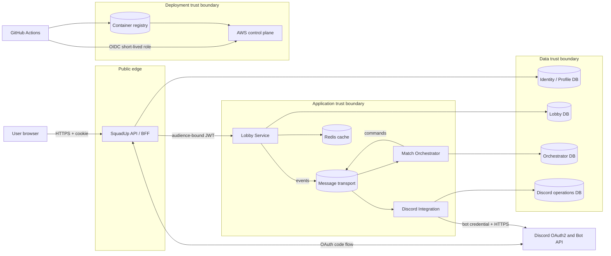

# Initial threat model

- Status: Initial baseline
- Date: 2026-09-01
- Scope: Squad-Up pilot architecture
- Review owners: Squad-Up maintainers

## Purpose and method

This document records plausible ways the designed system can be abused before
the affected features are implemented. It is a living engineering artifact,
not a claim that Squad-Up is secure or legally compliant.

We use STRIDE to ask consistent questions about each process, data store, data
flow, external actor, and trust boundary:

| Category | Question |
| --- | --- |
| Spoofing | Can an attacker impersonate a user, workload, or external service? |
| Tampering | Can data or code be changed without detection or authorization? |
| Repudiation | Can a security-sensitive action be denied because evidence is missing? |
| Information disclosure | Can data reach an unauthorized party or system? |
| Denial of service | Can finite capacity or paid external operations be exhausted? |
| Elevation of privilege | Can an identity gain capabilities it was not granted? |

Priority is a qualitative combination of likelihood and impact for the pilot:

- **Critical**: credible compromise of privileged credentials or broad control;
- **High**: likely account/resource compromise, sensitive disclosure, or costly
  service abuse;
- **Medium**: bounded impact, reduced likelihood, or meaningful recovery path;
- **Low**: limited impact and simple recovery.

The priority orders work. It is not a probability calculation.

## Scope

### In scope

- browser and the public Squad-Up API/BFF;
- Discord OAuth2 and Discord bot API integration;
- API-to-Lobby synchronous calls;
- RabbitMQ locally and SQS/SNS in AWS;
- PostgreSQL, Redis, logs, traces, and build/deployment artifacts;
- the Lobby, Match Orchestrator, and Discord Integration processes;
- GitHub Actions, container images, Terraform, AWS identities, and secrets;
- developer and AI-agent access to repository and test data.

### Out of scope for this baseline

- Discord's internal platform implementation;
- end-user devices after data has legitimately been displayed;
- payment data, real-name verification, direct messages, and file uploads, which
  are not pilot features;
- mobile and CLI authentication, which require their own design review if added.

## Data-flow and trust boundaries

Every arrow crossing a subgraph boundary is untrusted until its transport,
identity, authorization, schema, size, freshness, and failure behavior have
been validated. Being inside a VPC does not establish authorization.

## Assets and security objectives

| Asset | Primary objective |
| --- | --- |
| User identity and external-login association | Integrity and confidentiality |
| Browser session and signing material | Confidentiality and authenticity |
| Lobby membership, capacity, and ownership | Integrity and availability |
| Match saga and Discord operation state | Integrity and recoverability |
| Discord bot token and provisioned channels | Confidentiality and least privilege |
| Messages, inbox, outbox, and DLQ | Integrity, bounded disclosure, replay safety |
| Audit records | Integrity, access control, and useful retention |
| Source, dependencies, images, workflows, and Terraform | Integrity and provenance |

The detailed handling rules are in
[data classification](data-classification.md).

## Threat register

`Planned` means the control is a requirement but has not yet been proven by an
executable test. A threat moves to `Mitigated` only when the referenced control
and verification exist.

| ID | STRIDE | Scenario and impact | Priority | Required controls and verification | Status |
| --- | --- | --- | --- | --- | --- |
| TM-01 | S, T | An attacker starts or alters an OAuth callback, causing login CSRF, `state` mismatch, or callback replay. | High | Random single-use `state`, short correlation lifetime, exact redirect URI, server-side code exchange; negative tests for missing, mismatched, expired, and replayed values. | Planned |
| TM-02 | S, E | A Discord identity is silently linked to the wrong local account or a collision is merged. | High | Unique external-login constraint, explicit linking ceremony for signed-in users, reauthentication, no automatic merge; collision and race tests. | Partially mitigated |
| TM-03 | S, E | A stolen cookie, JWT, or future refresh token is replayed to impersonate a user or workload. | High | Secure/HttpOnly cookie, short session bounds, audience-specific short JWT, key rotation, token-family rotation/reuse detection if refresh tokens are introduced; replay and wrong-audience tests. | Partially mitigated |
| TM-04 | E, I | Changing a lobby or match identifier exposes or modifies another user's resource (IDOR/BOLA). | High | Resource-based authorization after loading current state, owner/moderator policy, response DTO allowlist; user-A-versus-user-B negative tests for every identifier endpoint. | Planned |
| TM-05 | T, E | Request binding changes protected fields such as role, owner, verification state, rank ordinal, or capacity. | High | Command-specific input DTOs, server-owned fields excluded from binding, catalog validation, authorization per property; over-posting tests. | Planned |
| TM-06 | S, T | A forged, stale, duplicated, or incompatible message causes an invalid state transition or repeated effect. | High | Broker IAM/credentials, versioned allowlisted contracts, schema and size validation, stable message IDs, inbox/outbox, optimistic state checks; duplicate, reorder, old-version, and unauthorized-publisher tests. | Planned |
| TM-07 | I, R | A poison message containing pseudonymous data remains in a DLQ, leaks through tooling, or is replayed without an audit trail. | High | Minimize message fields, encrypt transport/storage, restrict DLQ access, redact operator output, bounded retention, audited selective redrive; sanitized poison-message test and access review. | Planned |
| TM-08 | E, D, R | A user or repeated delivery creates excessive Discord channels/invites, exposes a channel, or leaves orphaned resources. | High | Unique operation by `MatchId`, deterministic reconciliation marker, restrictive permission overwrites, expiring invite, rate limits, quotas, cleanup workflow, audit actor; duplicate-delivery and partial-failure tests. | Planned |
| TM-09 | S, I | User-controlled configuration or URL makes a service call an attacker-selected host, including metadata or internal endpoints (SSRF). | High | Fixed Discord base address in trusted configuration, HTTPS and certificate validation, no arbitrary URL request fields, restricted egress; malicious URL/configuration tests. | Planned |
| TM-10 | I, E | A secret appears in source, `.env`, logs, traces, crash dumps, CI artifacts, test fixtures, support output, or an AI prompt. | Critical | User Secrets locally, Secrets Manager/IAM in AWS, centralized redaction, secret scan, artifact review, least-privilege access and rotation runbooks; seeded-canary redaction tests. | Planned |
| TM-11 | T, D | Crafted cache keys or values poison reads, bypass tenant/resource separation, or create unbounded key cardinality. | Medium | Server-generated versioned keys, normalized bounded filters, TTL and size limits, never cache authorization/session/reservation decisions; key-isolation and cardinality tests. | Planned |
| TM-12 | D | High-cardinality identities, filters, trace attributes, or rate-limit keys exhaust memory, telemetry budget, database pools, or paid APIs. | High | Layered rate limits and quotas, bounded request sizes/cardinality, no user IDs as metric labels, timeouts and concurrency limits; load tests for unique keys and expensive flows. | Planned |
| TM-13 | T, E | A compromised package, action, image, workflow, or build credential changes the delivered application. | Critical | Locked dependencies, commit-SHA-pinned actions, minimal workflow permissions, GitHub OIDC, protected branches, dependency/secret/SAST scans, SBOM, image digest and provenance; CI policy tests. | Partially mitigated |
| TM-14 | T, R | A user denies cancelling a lobby, changing privilege, or replaying a message because audit records are missing or editable. | Medium | Structured audit event with actor, action, target, result, time, and correlation ID; restricted append path and retention; success/failure audit tests without sensitive payloads. | Planned |
| TM-15 | I | APIs, logs, traces, cache, or integration events expose more profile/member data than the consumer requires. | High | Explicit DTO and contract allowlists, field-level authorization, data-classification review, log redaction, no full entity serialization; response and telemetry snapshot tests. | Planned |
| TM-16 | D, T | Concurrent joins overfill a lobby or create inconsistent membership and completion events. | High | Domain invariant, unique membership constraint, optimistic concurrency, atomic outbox and bounded retry; at least 50 concurrent joins into five seats. | Planned |

TM-02 is partially mitigated by the transactional external-login service: the
existing `(login_provider, provider_key)` primary key prevents one Discord
identity from belonging to multiple local users, local-account operations are
serialized before checking for a second Discord login, collision outcomes do
not merge accounts, and unlink refuses to remove the final login method.
PostgreSQL integration tests cover duplicate upsert, concurrent upsert,
cross-account collision, and concurrent unlink. The authenticated HTTP linking
ceremony and reauthentication remain required before link/unlink is exposed.

TM-03 is partially mitigated by the bounded BFF session and internal JWT
boundary. The browser cookie is host-only, Secure, HttpOnly, SameSite=Lax,
non-sliding, and expires absolutely after 30 minutes; cookie-authenticated
mutations require antiforgery. API-to-Lobby tokens are RS256, expire after two
minutes, carry explicit workload or delegated-user identity plus allowlisted
scope, and are rejected for invalid signature, algorithm, issuer, audience,
lifetime, client, actor kind, or scope. Lobby accepts an additive public-key
rotation window but rejects private signing material. Server-side session
revocation and any future bearer refresh-token rotation/reuse detection remain
unimplemented.

## Cross-cutting security requirements

- Deny by default at public, service, broker, database, secret, and deployment
  boundaries.
- Authenticate the caller and authorize the requested resource or capability;
  network placement is not a role.
- Validate type, range, length, count, and allowed values at every external
  boundary before allocating expensive work.
- Encrypt external and cross-host traffic. Give each process separate database,
  message, and secret permissions.
- Never log credentials or full request/message bodies. Sanitize control
  characters in values that are permitted in structured logs.
- Preserve correlation and actor evidence for privileged or destructive actions
  without storing the credential used to authenticate them.
- Design every externally billed effect, especially Discord provisioning, with
  quotas, idempotence, reconciliation, and cleanup.
- Use synthetic data in development, CI, and the initial AWS sandbox.

## Review triggers

Review this model when a pull request introduces or materially changes:

- an endpoint, integration message, trust boundary, external service, or data
  store;
- authentication, authorization, secret handling, logging, or retention;
- a user-controlled URL, file, rich text, webhook, or callback;
- a paid or finite external operation;
- CI/CD identity, dependency source, container base, Terraform, or AWS topology;
- real-user data in the cloud sandbox or a production deployment.

At production-readiness review, every Critical and High threat must have an
owner, executable evidence, and an explicitly accepted residual risk. The model
must also be reviewed after a security incident.

## Sources

- [Microsoft STRIDE threat categories](https://learn.microsoft.com/en-us/azure/security/develop/threat-modeling-tool-threats)
- [OWASP API Security Top 10 (2023)](https://owasp.org/API-Security/editions/2023/en/0x11-t10/)
- [OWASP Logging Cheat Sheet](https://cheatsheetseries.owasp.org/cheatsheets/Logging_Cheat_Sheet.html)
- [OWASP Threat Model Library](https://owasp.org/www-project-threat-model-library/)
