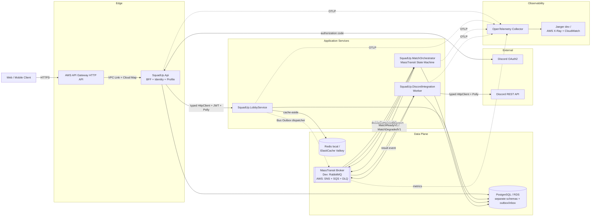
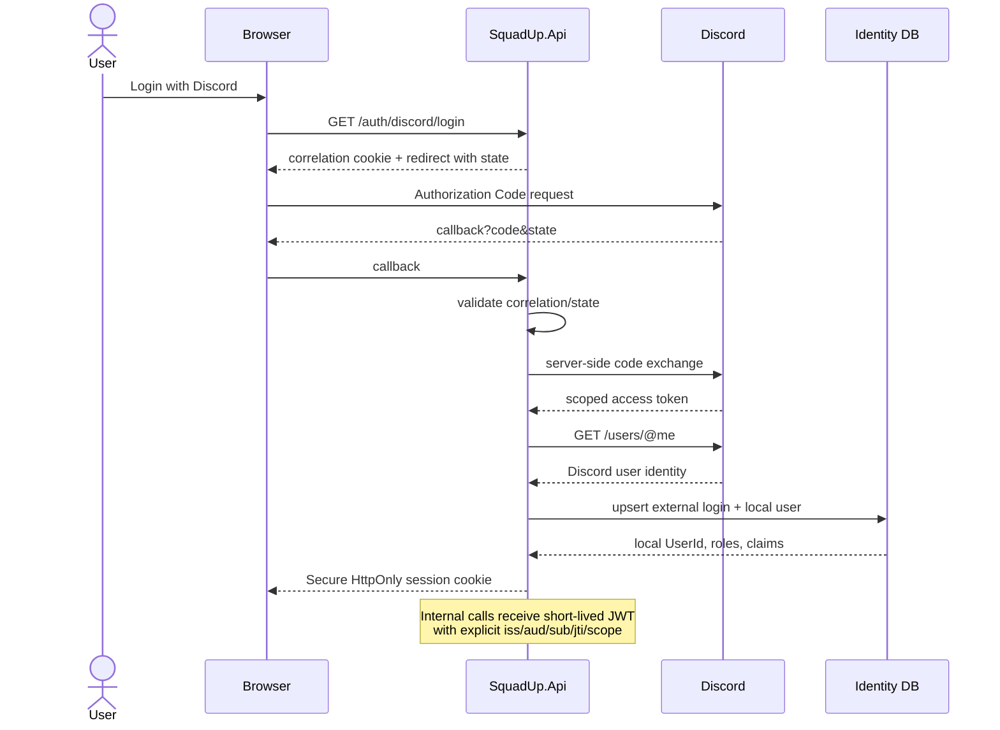
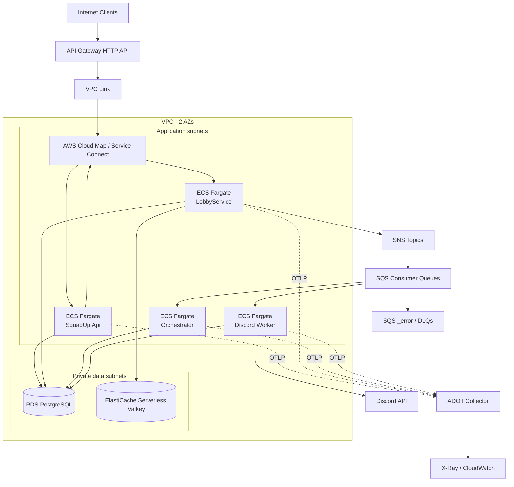

# Squad-Up — Plano de Arquitetura e Implementação

> Plano greenfield para evolução de desenvolvedor .NET Pleno para Senior, com foco deliberado em sistemas distribuídos, operação e decisões arquiteturais demonstráveis.

| Campo | Valor |
|---|---|
| Data-base do plano | 2026-09-01 |
| Runtime recomendado | .NET 10 LTS |
| Banco transacional | PostgreSQL |
| Transporte local principal | RabbitMQ |
| Transporte AWS principal | Amazon SQS + SNS |
| Cache | Redis local; ElastiCache Serverless for Valkey em AWS |
| Orquestração | MassTransit Saga State Machine + EF Core |
| MassTransit baseline | 8.5.x permissiva e pinada; v9 opcional mediante licença/ADR |
| Princípio de entrega | At-least-once, com efeitos idempotentes |
| Estratégia de evolução | Arquitetura evolutiva, bounded contexts e contratos versionados |

Este documento é uma baseline, não um contrato imutável. Versões de pacotes, preços, limites e disponibilidade regional devem ser novamente verificados antes de cada sprint de infraestrutura. A escolha de .NET 10 é intencional: ele está em suporte LTS ativo até novembro de 2028 na data deste plano ([política oficial de suporte do .NET](https://dotnet.microsoft.com/en-us/platform/support/policy)).

---

## 1. Resultado esperado e decisões executivas

Ao final do roadmap, o Squad-Up deverá demonstrar, em código e em operação, o seguinte caminho crítico:

1. O jogador entra usando Discord OAuth2.
2. A aplicação cria ou associa uma identidade local e emite uma sessão segura; chamadas internas usam JWT de curta duração.
3. O jogador mantém perfil, jogos e ranks.
4. O Lobby Service cria, pesquisa e preenche lobbies com controle explícito de concorrência.
5. A transição `Recruiting -> Full` grava a mudança e `LobbyCompletedV1` atomicamente por meio do Transactional Outbox.
6. Uma saga durável inicia o provisionamento no Discord.
7. O Discord Worker cria um canal de voz privado, permission overwrites e convite, respeitando timeout, rate limit, circuit breaker e idempotência de efeito.
8. A saga publica o resultado ou degrada graciosamente a experiência sem perder a intenção da partida.
9. Traces, métricas e logs permitem seguir a operação do HTTP ao broker, outbox, saga e Discord.
10. Falhas simuladas — duplicidade, mensagem fora de ordem, RabbitMQ/SQS indisponível, Redis fora, Discord 429/5xx e processo encerrado após commit — têm comportamento testado e observável.
11. Todo push recebe CI; merge protegido em `main` constrói imagens imutáveis e implanta automaticamente em dev, enquanto uma release promove os mesmos digests para produção com gate e rollback.

### 1.1 Decisões principais

- Usar **quatro processos implantáveis** na arquitetura de referência: `SquadUp.Api`, `SquadUp.LobbyService`, `SquadUp.MatchOrchestrator` e `SquadUp.DiscordIntegration`.
- Manter identidade e perfil como módulos no processo `SquadUp.Api` inicialmente. Separá-los só quando escala, ownership ou segurança justificarem outro processo.
- Usar uma única instância RDS PostgreSQL no piloto por custo, mas com **database/schema, `DbContext`, migrations e usuário separados por bounded context**. Nenhum serviço acessa tabelas de outro.
- Usar RabbitMQ no loop local rápido e LocalStack/SQS em testes de paridade. Produção usa SQS/SNS para evitar um broker sempre ligado e sua carga operacional.
- Usar MassTransit Bus Outbox para requisições HTTP e Consumer Outbox/inbox para consumidores. Não prometer “exactly once” ponta a ponta.
- Usar uma saga para o processo de match e provisionamento no Discord. A saga coordena; cada serviço continua dono de sua transação local.
- Usar `Microsoft.Extensions.Http.Resilience`, baseado em Polly v8, em vez do pacote legado `Microsoft.Extensions.Http.Polly`, hoje descontinuado para essa finalidade ([resiliência em .NET](https://learn.microsoft.com/en-us/dotnet/core/resilience/)).
- Usar CQRS como separação de intenção e modelos, sem presumir que toda operação precisa de MediatR. O padrão é obrigatório; a biblioteca é opcional.
- Usar rich domain model onde existem invariantes (`Lobby`, `LobbyMembership`, `RankRequirement`) e modelos anêmicos somente para DTOs, projections e read models.
- Usar cache como otimização descartável. PostgreSQL continua sendo a fonte da verdade.
- Não executar `Database.Migrate()` no startup de processos de produção. Migrations são artefatos de deploy revisados.

### 1.2 Baseline e decisão de licença do MassTransit

O laboratório começa com **MassTransit 8.5.x**, linha permissiva que contém os recursos necessários e possui pacote compatível com .NET 10 ([MassTransit 8.5.10 no NuGet](https://www.nuget.org/packages/MassTransit/8.5.10)). Fixar uma versão 8.5.x validada em conjunto para todos os pacotes MassTransit, sem ranges, em `Directory.Packages.props` e habilitar lock file do NuGet.

Na data deste plano, **MassTransit v9 é comercial/source-available**. O fornecedor informa que organizações com receita bruta anual inferior a US$ 1 milhão podem se qualificar para desconto de 100% ([licenciamento MassTransit/Massient](https://massient.com/)). A v9 não é necessária para cumprir o laboratório; é uma decisão futura:

1. Abrir `ADR-000-masstransit-version-and-license.md` registrando v8.5.x como baseline.
2. Monitorar CVEs, compatibilidade, correções e o custo de permanecer na v8.
3. Antes de produção real ou upgrade relevante do runtime, avaliar migração para v9 com licença válida e chave no secret store.
4. Exercitar a atualização em branch, ler o guia de upgrade, rodar contract/integration/fault tests e só então alterar o lock file.

### 1.3 Fora do escopo inicial

- Chat, feed social, recomendação por ML e torneios.
- Suporte multi-guild irrestrito no Discord.
- Kubernetes/EKS, service mesh e event sourcing.
- CQRS com bancos físicos separados para escrita e leitura.
- Disponibilidade multi-região e active-active.
- Front-end completo; uma UI mínima ou Swagger é suficiente até o fluxo distribuído estar sólido.

Esses itens não são proibidos. Eles ficam fora do MVP para preservar profundidade nos gaps técnicos definidos.

---

## 2. Arquitetura lógica e visão de componentes

### 2.1 Bounded contexts e responsabilidades

| Componente implantável | Responsabilidade | Dados próprios | Interfaces |
|---|---|---|---|
| `SquadUp.Api` | Edge/BFF, Discord OAuth2, ASP.NET Core Identity, perfil, emissão/renovação de tokens, rate limiting de entrada e fachada para lobbies | `identity` e `profile` | HTTP público; HTTP interno para Lobby; eventos de perfil quando necessários |
| `SquadUp.LobbyService` | Catálogo de jogos/ranks, criação, busca, entrada/saída e conclusão concorrente de lobby | `lobby` + tabelas de outbox/inbox | HTTP interno; publica `LobbyCompletedV1` e eventos de cache |
| `SquadUp.MatchOrchestrator` | Saga de longa duração, timeout, retry durável, compensação e estado operacional do match | `orchestration` + saga/outbox/inbox | Consome eventos; envia comandos; publica estado do match |
| `SquadUp.DiscordIntegration` | Adaptador anticorrupção para Discord, provisionamento/reconciliação/remoção de recursos e notificação | `discord_integration` + outbox/inbox | Consome comandos; chama Discord REST; publica resultados |
| `SquadUp.Contracts` | Contratos de integração imutáveis e versionados | Nenhum | Pacote .NET compartilhado, sem entidades de domínio |
| `SquadUp.ServiceDefaults` | Telemetria, health checks, Problem Details, convenções de correlação e configuração comum estável | Nenhum | Extensões de DI; não contém regras de negócio |

Não criar um grande `SquadUp.Infrastructure` referenciado por todos. Ele viraria um ponto de acoplamento entre EF mappings, transportes e fornecedores. Cada bounded context possui sua própria Infrastructure; somente primitives realmente estáveis entram em building blocks.

### 2.2 Estrutura recomendada da solução

```text
SquadUp.slnx
Directory.Build.props
Directory.Packages.props
global.json
.editorconfig
compose.yaml
compose.override.yaml
AGENTS.md

src/
  BuildingBlocks/
    SquadUp.Contracts/
    SquadUp.ServiceDefaults/
    SquadUp.BuildingBlocks/

  Api/
    SquadUp.Api/                       # host HTTP/BFF
    SquadUp.Identity.Domain/
    SquadUp.Identity.Application/
    SquadUp.Identity.Infrastructure/
    SquadUp.Profile.Domain/
    SquadUp.Profile.Application/
    SquadUp.Profile.Infrastructure/

  Lobby/
    SquadUp.LobbyService.Api/          # host HTTP e composição
    SquadUp.LobbyService.Domain/
    SquadUp.LobbyService.Application/
    SquadUp.LobbyService.Infrastructure/

  Orchestration/
    SquadUp.MatchOrchestrator.Worker/
    SquadUp.MatchOrchestrator.Application/
    SquadUp.MatchOrchestrator.Infrastructure/

  Discord/
    SquadUp.DiscordIntegration.Worker/
    SquadUp.DiscordIntegration.Application/
    SquadUp.DiscordIntegration.Infrastructure/

tests/
  SquadUp.ArchitectureTests/
  SquadUp.Contracts.Tests/
  SquadUp.Api.UnitTests/
  SquadUp.Api.IntegrationTests/
  SquadUp.LobbyService.UnitTests/
  SquadUp.LobbyService.IntegrationTests/
  SquadUp.MatchOrchestrator.Tests/
  SquadUp.DiscordIntegration.Tests/
  SquadUp.EndToEndTests/
  SquadUp.FaultInjectionTests/

deploy/
  docker/
  terraform/
    bootstrap/
    modules/
      network/
      edge/
      ecs-service/
      data/
      messaging/
      observability/
      identity-and-secrets/
    environments/
      sandbox/
      production/

docs/
  adr/
  runbooks/
  diagrams/
  contracts/
  threat-model/

.agents/
  skills/
.cursor/
  rules/
```

### 2.3 Regras de dependência

```text
Domain <- Application <- Infrastructure <- Host
                  ^             |
                  +-------------+

Contracts não referencia Domain, EF Core, MassTransit ou hosts.
Domain referencia apenas BCL e abstrações mínimas deliberadas.
```

- Domain não conhece `DbContext`, MassTransit, Redis, Discord SDK, ASP.NET ou MediatR.
- Application contém casos de uso, ports e validação de orquestração local.
- Infrastructure implementa repositories, EF mappings, outbox, broker, cache e clientes externos.
- Host é composition root e contém endpoints/middleware/configuração.
- Um bounded context nunca referencia a Infrastructure de outro.
- Contratos de integração carregam dados, não comportamento, e usam nomes no passado para eventos e verbo no imperativo para comandos.

### 2.4 Diagrama de componentes e fluxo de dados



O diagrama mostra a topologia AWS. Em desenvolvimento, `apigw` é substituído por portas locais, o broker principal é RabbitMQ e o backend de traces é Jaeger.

### 2.5 Sequência do caminho crítico

```mermaid
sequenceDiagram
    autonumber
    actor Player
    participant API as SquadUp.Api
    participant Lobby as LobbyService
    participant DB as PostgreSQL
    participant Outbox as Outbox Delivery
    participant Bus as RabbitMQ / SQS+SNS
    participant Saga as Match Saga
    participant Worker as Discord Worker
    participant Discord as Discord API

    Player->>API: POST /lobbies/{id}/members<br/>Idempotency-Key
    API->>Lobby: JoinLobby + short-lived JWT
    Lobby->>DB: transaction: membership + count + status + outbox
    DB-->>Lobby: commit
    Lobby-->>API: 200/201 + lobby version
    API-->>Player: accepted/completed state
    Outbox->>DB: claim pending outbox rows
    Outbox->>Bus: publish LobbyCompletedV1
    Bus->>Saga: consume (at-least-once)
    Saga->>DB: persist saga + outbox command
    Outbox->>Bus: send ProvisionDiscordMatchV1
    Bus->>Worker: consume command
    Worker->>DB: reserve idempotent operation
    Worker->>Discord: create/reconcile channel and invite
    alt success
        Discord-->>Worker: channel/invite metadata
        Worker->>DB: mark provisioned + result in outbox
        Outbox->>Bus: DiscordMatchProvisionedV1
        Bus->>Saga: correlate by MatchId
        Saga->>DB: state Ready + outbox
        Outbox->>Bus: MatchReadyV1
    else transient/rate limited
        Discord-->>Worker: 429/5xx/timeout
        Worker-->>Bus: retry/redelivery with bounded jitter
        Note over Saga,Worker: UI reports setup delayed; intent is retained
    else permanent failure / retries exhausted
        Worker-->>Bus: Fault + _error/DLQ
        Bus->>Saga: DiscordProvisioningFailedV1/Fault
        Saga->>DB: state NeedsAttention + outbox
        Outbox->>Bus: MatchDegradedV1
    end
```

---

## 3. Modelo de domínio, dados e APIs

### 3.1 Agregados e invariantes

#### Identity/Profile

- `ApplicationUser`: identidade local estável; Discord é um external login, não a primary key do domínio.
- `PlayerProfile`: nickname público, timezone opcional e status.
- `PlayerGame`: `PlayerId`, `GameId`, `RankTierId`, região e timestamp de verificação.
- Discord user access/refresh tokens somente são persistidos se realmente necessários. Para login básico, descartar após obter `/users/@me`; o bot token é credencial de workload separada.

#### Lobby

- `Lobby` é aggregate root.
- Estados mínimos: `Recruiting`, `Full`, `Provisioning`, `Ready`, `Cancelled`, `Completed`, `Expired`.
- Invariantes:
  - capacidade entre limites configurados;
  - um jogador aparece no máximo uma vez;
  - somente `Recruiting` aceita entrada;
  - rank do jogador satisfaz o requisito do jogo;
  - `MembersCount <= Capacity` por regra de domínio e constraint de banco;
  - somente a transição que completa a capacidade gera `LobbyCompleted`;
  - cancelamento e conclusão são transições explícitas, nunca flags independentes inconsistentes.
- `RankRequirement` é value object baseado no `GameId` e em ordinais do catálogo. Strings como “Lenda” não são comparadas diretamente.
- O membership guarda um snapshot mínimo do Discord user id e display name usado no match. Isso reduz acoplamento síncrono posterior; o dado é tratado como pseudonymous PII.

#### Match orchestration

- `MatchState` é a saga persistida, não uma entidade compartilhada com Lobby.
- Estados: `Initial`, `ProvisioningDiscord`, `Ready`, `ProvisioningFailed`, `Compensating`, `Cancelled`, `Completed`.
- Campos: `CorrelationId/MatchId`, `LobbyId`, attempt, deadline, Discord operation id, channel id e timestamps.

#### Discord integration

- `DiscordProvisioningOperation` tem chave única por `MatchId`.
- Estados: `Reserved`, `ChannelObserved`, `ChannelCreated`, `PermissionsApplied`, `InviteCreated`, `Notified`, `Completed`, `CompensationPending`, `Compensated`, `NeedsReconciliation`.
- A granularidade é proposital: Discord não participa da transação PostgreSQL. Estado intermediário permite descobrir se um timeout ocorreu antes ou depois de o efeito externo ter sido criado.

### 3.2 Concorrência para preenchimento do lobby

Somente validar `Count < Capacity` em memória é incorreto. Duas requisições podem ler quatro membros de um lobby 5/5 e ambas inserir o quinto.

Implementação recomendada:

1. `Lobby` mantém `MembersCount` e um concurrency token (`xmin` do PostgreSQL ou coluna de versão gerenciada).
2. Há unique constraint `(lobby_id, player_id)`.
3. O comando carrega o aggregate, adiciona o membro, incrementa a versão e salva em uma transação curta.
4. `DbUpdateConcurrencyException` resulta em reload + nova avaliação limitada; se cheio, retorna conflito de domínio.
5. A alternativa de maior throughput é um `UPDATE ... SET members_count = members_count + 1 WHERE id = @id AND status = 'Recruiting' AND members_count < capacity RETURNING ...`, seguido do insert na mesma transação. Documentar em ADR se for adotada, pois desloca parte da regra para SQL.
6. A mudança para `Full` e a mensagem de integração entram no mesmo `SaveChangesAsync` via Bus Outbox.

Testar com pelo menos 50 joins concorrentes para um lobby de cinco vagas. O resultado aceito é exatamente cinco memberships, um único evento lógico de conclusão e respostas determinísticas para os demais.

### 3.3 Endpoints mínimos

| Método | Endpoint | Observações |
|---|---|---|
| `GET` | `/auth/discord/login` | Inicia Authorization Code Grant; correlation cookie e `state` |
| `GET` | `/auth/discord/callback` | Troca code server-side e cria/associa external login |
| `POST` | `/auth/refresh` | Rotaciona refresh token; detecta reuse |
| `POST` | `/auth/revoke` | Revoga sessão atual ou família |
| `GET` | `/me/profile` | Dados do usuário atual |
| `PUT` | `/me/profile` | Validação e concurrency token |
| `PUT` | `/me/games/{gameId}` | Cadastra rank do jogo |
| `POST` | `/lobbies` | Exige `Idempotency-Key` |
| `GET` | `/lobbies` | Filtros, keyset pagination, read model cacheado |
| `GET` | `/lobbies/{lobbyId}` | Pode retornar versão e estado de provisionamento |
| `POST` | `/lobbies/{lobbyId}/members` | Exige `Idempotency-Key`; operação concorrente crítica |
| `DELETE` | `/lobbies/{lobbyId}/members/me` | Saída idempotente quando permitida |
| `POST` | `/lobbies/{lobbyId}/cancel` | Resource-based authorization: owner/moderator |
| `GET` | `/matches/{matchId}` | Estado eventual da saga; suporta polling inicial |

Todos os erros HTTP seguem RFC 9457 Problem Details, com `traceId`, código estável de domínio e sem stack trace/segredo no payload.

### 3.4 Dados por schema/database lógico

| Owner | Tabelas principais |
|---|---|
| Identity/Profile | `users`, `user_logins`, `roles`, `user_roles`, `refresh_token_families`, `player_profiles`, `player_games` |
| Lobby | `lobbies`, `lobby_members`, `game_catalog`, `rank_tiers`, `http_idempotency_keys`, `inbox_state`, `outbox_message`, `outbox_state` |
| Orchestrator | `match_states`, `inbox_state`, `outbox_message`, `outbox_state` |
| Discord | `discord_provisioning_operations`, `discord_resources`, `inbox_state`, `outbox_message`, `outbox_state` |

Mesmo que a instância física seja compartilhada, connection strings e grants são diferentes. Um serviço não faz join SQL entre contextos. Integração ocorre por API ou eventos.

### 3.5 Contratos de integração

Exemplo conceitual:

```csharp
namespace SquadUp.Contracts.Lobbies.V1;

public sealed record LobbyCompletedV1(
    Guid EventId,
    Guid LobbyId,
    Guid MatchId,
    string GameId,
    string DiscordGuildId,
    IReadOnlyList<LobbyParticipantV1> Participants,
    DateTimeOffset OccurredAtUtc);

public sealed record LobbyParticipantV1(
    Guid PlayerId,
    string DiscordUserId,
    string DisplayName);
```

Regras:

- `EventId` identifica o fato; `CorrelationId` e `CausationId` ficam também nos headers MassTransit/OpenTelemetry.
- Contratos usam tipos serializáveis simples e não expõem entidades EF.
- Mudanças aditivas e opcionais permanecem em V1. Mudanças semânticas/breaking criam `V2` e período de coexistência.
- Nunca renomear queue/topic ou namespace de contrato silenciosamente.
- Manter fixtures JSON de compatibilidade no repositório.
- Não enviar access token, bot token, e-mail ou invite permanente no evento.

---

## 4. Mapeamento prático dos gaps técnicos

| Gap | Biblioteca/componente .NET | Aplicação concreta no Squad-Up | Evidência/critério de aceite |
|---|---|---|---|
| Mensageria robusta | MassTransit + RabbitMQ + Amazon SQS/SNS | Consumer definitions, retry curto, redelivery durável, `_error`/DLQ, `Fault<T>`, concorrência por endpoint, headers de correlação e contratos versionados | Testes derrubam consumer/broker, duplicam e reordenam mensagens; não há membro/canal duplicado; DLQ gera alerta e pode ser redriven com auditoria |
| At-least-once e idempotência | MassTransit Consumer Outbox/inbox, unique constraints, idempotency ledger e operation state | Deduplicação por `MessageId`; chave única por `MatchId`; HTTP `Idempotency-Key`; reconciliação do efeito externo | Mesmo comando entregue N vezes produz uma única operação lógica e resposta repetível |
| Backoff exponencial com jitter | MassTransit retry/redelivery + provider/filtro de intervalos testado; Polly v8 para HTTP | Retry em memória apenas para falhas breves; redelivery libera o slot; full jitter limitado para evitar retry storm; `Retry-After` do Discord tem precedência | Teste estatístico verifica limites e dispersão; nenhum `Thread.Sleep`; métrica por tentativa |
| DLQ e poison messages | RabbitMQ `_error`/`_skipped`; SQS `_error` com redrive policy | Após orçamento de retries, mensagem e headers ficam preservados; consumer de `Fault<T>` atualiza painel; runbook de inspeção/correção/replay | Alarme `DLQ depth > 0`; replay selecionado não repete efeito externo |
| Resiliência HTTP | `Microsoft.Extensions.Http.Resilience`, Polly v8, typed `HttpClient` | Rate limiter, total timeout, attempt timeout, retry com jitter e circuit breaker para Discord e chamadas internas | Testes WireMock simulam 429, 5xx, timeout, conexão resetada e circuito aberto |
| Graceful degradation | Problem Details, cache stale, estados de saga e outbox | Busca pode servir snapshot stale; Redis é bypassado; comando preservado no outbox; Discord indisponível vira “setup delayed”, não falso sucesso | Matriz de falhas documentada e E2E; API continua saudável onde a dependência é opcional |
| OAuth2/JWT/Identity | ASP.NET Core Identity, OAuth handler/`AspNet.Security.OAuth.Discord` após avaliação, `JwtBearer`, Data Protection | Discord Authorization Code, usuário local, cookie BFF por padrão, JWT interno curto, refresh rotation, policies e resource authorization | Testes de state/correlation, issuer/audience/signature/expiry, role escalation, CSRF e token reuse |
| Claims/RBAC | `IAuthorizationService`, requirements/handlers | Roles `Player`, `Moderator`, `Admin`; claims `sub`, `scope`, `role`, `discord_user_id`; ownership do lobby é autorização baseada no recurso | Endpoint tests provam 401 vs 403 e impedem IDOR |
| Segredos | .NET User Secrets local; AWS Secrets Manager + IAM task roles + KMS em produção | Discord client secret, bot token, signing material, DB credentials e licença MassTransit fora do repositório | Secret scan limpo; rotação ensaiada; aplicação usa least privilege |
| Docker/Cloud/IaC e CI/CD | Docker multi-stage, .NET chiseled, Terraform, GitHub Actions/OIDC, ECR, ECS Fargate, API Gateway, RDS, SQS/SNS, ElastiCache | Imagens ARM64/non-root; build once; ambientes isolados; deploy automático de `main` em dev e promoção por digest para produção | Required checks, `terraform fmt/validate/plan`, SBOM/attestation, migration one-shot, smoke, rollback e destroy do sandbox |
| Zero-downtime schema | EF Core migrations, migration bundles/scripts, PostgreSQL online DDL, expand-contract | Add nullable, dual write/read, backfill em lotes, validate, contract em release posterior | App N e N+1 rodam contra schema expandido; lock timeout e rollback ensaiados |
| Transações distribuídas | EF Core Transactional Bus/Consumer Outbox + MassTransit saga state machine | Lobby commit + evento; saga persistida + comandos; compensação/reconciliação Discord | Kill tests nos limites commit/publish/external call comprovam recuperação |
| Observabilidade | `ActivitySource`, `Meter`, OpenTelemetry .NET, Serilog, OTLP Collector, Jaeger/ADOT/X-Ray | Trace HTTP -> publish -> consume -> Discord; métricas de negócio e runtime; JSON logs com trace/span ids | Um `MatchId` é rastreável ponta a ponta; dashboards e alertas têm runbooks |
| Performance .NET | `dotnet-counters`, `dotnet-trace`, `dotnet-stack`, `dotnet-dump`, NBomber | Cenário de sync-over-async/threadpool starvation reproduzido e diagnosticado em laboratório | Relatório before/after com counters, trace e latência p95/p99 |
| Cache distribuído | `HybridCache`, `IDistributedCache`, `Microsoft.Extensions.Caching.StackExchangeRedis`, StackExchange.Redis | L1/L2, cache-aside, TTL com jitter, tags/versioned keys, lease distribuído e stale-while-revalidate | Load test de hot key; Redis outage não quebra writes; hit ratio e stampede observáveis |

---

## 5. Mensageria, Outbox e Saga

### 5.1 Semântica honesta

- O broker entrega **at least once**. Duplicatas e reordenação são condições normais.
- O Transactional Outbox torna atômicos “alterar o banco local” e “registrar a intenção de publicar”. A entrega ao broker continua repetível.
- O Consumer Outbox combina inbox/deduplicação com buffer durável de mensagens produzidas. A documentação do MassTransit ressalta que outbox, retry/redelivery e idempotência resolvem problemas diferentes e devem ser usados em conjunto ([MassTransit Outbox](https://masstransit.io/documentation/patterns/transactional-outbox)).
- “Exactly once” só pode ser afirmado para uma fronteira local muito específica. Não existe transação única entre PostgreSQL, SQS/RabbitMQ e Discord.
- O objetivo real é **at-least-once delivery + idempotent processing + observable reconciliation**.

### 5.2 Topologia sugerida

| Tipo | Nome lógico | Produtor | Consumidor | Observação |
|---|---|---|---|---|
| Evento | `lobby-completed-v1` | Lobby | Orchestrator | Publish/fan-out; inicia saga |
| Comando | `provision-discord-match-v1` | Orchestrator | Discord worker | Send direto para reduzir custo/topologia no SQS |
| Evento | `discord-match-provisioned-v1` | Discord worker | Orchestrator | Resultado idempotente |
| Evento | `discord-provisioning-failed-v1` | Discord worker/ops policy | Orchestrator | Falha classificada após orçamento |
| Comando | `revoke-discord-resources-v1` | Orchestrator | Discord worker | Compensação idempotente |
| Evento | `match-ready-v1` | Orchestrator | API projection/notifications | Estado consumível pelo produto |
| Evento | `match-degraded-v1` | Orchestrator | API projection/ops | Não afirma que o canal existe |
| Evento | `lobby-cache-invalidated-v1` | Lobby | API/Lobby replicas | Otimização; perda tolerável por TTL |

Convenção física: `{environment}-{service}-{message-or-endpoint}-v1`. Commands são enviados à queue do único owner; events são publicados. No SQS, SNS faz fan-out para queues. A própria documentação do MassTransit aponta que enviar commands diretamente evita encaminhamento e custo desnecessários no SQS/SNS ([transporte Amazon SQS/SNS](https://masstransit.io/documentation/configuration/transports/amazon-sqs)).

### 5.3 Configuração de retry e redelivery

Classificar antes de repetir:

| Falha | Ação |
|---|---|
| Validation/domain conflict, 400/401/403/404 sem semântica transitória | Não repetir; registrar motivo e, se mensagem inválida, enviar para error queue |
| Deadlock/serialization, conexão resetada, 408, alguns 5xx | Retry curto e limitado |
| Discord 429 | Respeitar `Retry-After`; redelivery durável se exceder o pequeno budget HTTP |
| Dependência indisponível por minutos | Delayed/scheduled redelivery; não manter delivery/worker slot bloqueado |
| Contrato desconhecido/deserialização | `_error` ou `_skipped`, alerta imediato |
| Circuito aberto | Deferir trabalho; não martelar a dependência |

Baseline a calibrar por teste:

- Retry em memória: no máximo 2–3 tentativas, abaixo de aproximadamente 3 segundos no total.
- Redelivery: 4 tentativas com `full jitter`, base de 15 s, crescimento exponencial e cap de 5 min.
- Fórmula: `delay = random(0, min(cap, base * 2^attempt))`.
- Orçamento total de provisionamento: 10–15 min antes de `NeedsAttention`, separado do timeout de experiência mostrado ao usuário.
- `CancellationToken` sempre propagado.
- Nunca fazer sleep no consumer.

O MassTransit separa retry, que mantém a delivery, de redelivery, que a devolve ao broker para uma tentativa futura; falhas esgotadas vão por padrão para uma queue com sufixo `_error` e geram `Fault<T>` ([exceptions e faults](https://masstransit.io/documentation/concepts/exceptions)).

O requisito de jitter deve ser explicitamente provado. Se a versão escolhida não oferecer jitter por mensagem na API de redelivery utilizada, criar um pequeno interval provider/filtro encapsulado e testado, ou fazer a saga agendar a nova tentativa com delay calculado. Não espalhar cálculo aleatório em consumers.

### 5.4 DLQ/error queue e replay

#### RabbitMQ

- `_error`: processamento falhou após retry/redelivery.
- `_skipped`: mensagem chegou a endpoint sem consumer/topologia compatível.
- Se `UseDelayedRedelivery` usar delayed exchange, a imagem RabbitMQ local deve ter uma versão compatível e pinada do plugin `rabbitmq_delayed_message_exchange` habilitada. Caso a equipe não queira manter esse plugin, escolher um scheduler/redelivery durável suportado pela versão e registrar a decisão no ADR; não presumir que a imagem `rabbitmq:management` pura fornece o recurso.
- Habilitar management UI apenas localmente.
- Não criar um consumer que reenvia automaticamente tudo da `_error`.

#### SQS

- Usar SQS Standard por padrão; projetar para best-effort ordering e duplicidade.
- Configurar `EnableRedrivePolicy(maxReceiveCount)` quando compatível com a versão escolhida, usando a queue `_error` como DLQ.
- Retenção da source queue adequada ao SLA; DLQ com retenção maior.
- Visibility timeout maior que a duração máxima de uma tentativa do consumer. Operações longas devem ser divididas, não mascaradas com timeout enorme.
- SSE-SQS é suficiente no piloto; usar customer-managed KMS key somente quando o requisito de controle justificar custo/chamadas adicionais.

#### Runbook de replay

1. Alarme cria incidente com queue, message type, age, exception fingerprint e trace id — nunca payload sensível completo.
2. Operador classifica: bug, dado permanente, dependência ou contrato.
3. Corrigir/deployar antes do replay quando necessário.
4. Selecionar mensagens por critério; preservar `MessageId`, `CorrelationId` e payload original, adicionando `ReplayId`, actor e reason.
5. Redrive para a queue original por ferramenta auditável.
6. Validar inbox/idempotency ledger e efeitos Discord.
7. Encerrar incidente com contagem reconciliada.

### 5.5 Outbox por fronteira

#### Requisição HTTP no Lobby

`JoinLobbyHandler` modifica o aggregate e chama `IPublishEndpoint`. Com Bus Outbox, a mensagem entra nas tabelas do mesmo `LobbyDbContext`; um único commit contém lobby, membership e outbox. Um hosted delivery service publica posteriormente.

#### Consumer ou saga

Usar Consumer Outbox/EF Outbox no endpoint. A inbox trava/deduplica pelo `MessageId`; mensagens produzidas ficam duráveis até o commit. Definir a duplicate detection window com base na retenção/replay real, não em um número copiado.

#### Efeito no Discord

O outbox não torna a chamada HTTP atômica. O worker executa este protocolo:

1. Tenta inserir `DiscordProvisioningOperation(MatchId)`; unique constraint e estado existente tornam o comando repetível.
2. Se `Completed`, republica/recupera o mesmo resultado pelo outbox sem recriar recurso.
3. Se intermediário, consulta/reconcilia o canal conhecido.
4. Antes de criar, procura marcador determinístico controlado pela aplicação, por exemplo nome curto + topic/audit reason com `MatchId`. Não confiar apenas no nome visível.
5. Persiste o Discord channel id assim que observado.
6. Cria convite de curta duração e uso limitado, aplica permission overwrites e notifica.
7. Persiste `Completed` e publica resultado na mesma transação local.
8. Um reconciler periódico encontra operações intermediárias antigas e canais órfãos.

Timeout após um POST é ambíguo: o servidor pode ter criado o canal. Por isso retries automáticos de métodos unsafe ficam desabilitados no `HttpClient`; a aplicação reconcilia antes de repetir.

### 5.6 Saga de orquestração

| Estado/evento | Comportamento |
|---|---|
| `Initial + LobbyCompletedV1` | Criar saga por `MatchId`, guardar deadline e enviar `ProvisionDiscordMatchV1` |
| `ProvisioningDiscord + DiscordMatchProvisionedV1` | Guardar channel id, cancelar timeout, transicionar `Ready`, publicar `MatchReadyV1` |
| `ProvisioningDiscord + DiscordProvisioningDeferredV1` | Atualizar attempt/next attempt e manter estado visível |
| `ProvisioningDiscord + deadline` | Publicar `MatchDegradedV1`; manter possibilidade de recuperação operacional |
| `ProvisioningDiscord + permanent failure` | `ProvisioningFailed`/`NeedsAttention`; publicar degradação |
| `ProvisioningDiscord/Ready + LobbyCancelledV1` | Enviar `RevokeDiscordResourcesV1`, transicionar `Compensating` |
| `Compensating + DiscordResourcesRevokedV1` | `Cancelled` e finalizar após janela de auditoria |
| Evento atrasado em estado incompatível | Ignorar de forma explícita, medir e registrar; nunca lançar genericamente sem estratégia |

Usar repository EF Core PostgreSQL com optimistic concurrency e outbox. Particionar localmente por `MatchId` reduz colisões, mas não substitui concorrência no banco quando há múltiplas instâncias.

---

## 6. Resiliência, timeouts e graceful degradation

### 6.1 Pipelines Polly v8

O pipeline padrão de `Microsoft.Extensions.Http.Resilience` combina rate limiter, total timeout, retry com exponential backoff/jitter, circuit breaker e attempt timeout; a ordem é relevante ([HTTP resilience patterns](https://learn.microsoft.com/en-us/dotnet/core/resilience/http-resilience)). Para o Squad-Up, usar handlers customizados para tornar budgets e métodos seguros explícitos.

| Cliente | Attempt timeout | Total timeout | Retry | Circuit breaker | Limite concorrente |
|---|---:|---:|---|---|---:|
| Discord GET/reconciliação | 3 s | 10 s | 2, exponencial + jitter; 408/5xx/network | Ex.: 50% em 30 s, mínimo 20, break 30 s | Começar em 4 |
| Discord POST/PUT/DELETE | 5 s | 8 s | Sem retry HTTP cego; retry de operação após reconciliação | Mesmo pool por destino/rota conforme design | Começar em 2–4 |
| API -> Lobby GET | 1 s | 3 s | 1 retry com jitter | Ex.: 50% em 20 s, mínimo 20 | 50, calibrar |
| API -> Lobby command | 2 s | 3 s | Sem retry automático, ou 1 apenas com `Idempotency-Key` comprovado | Igual ao cliente interno | 20, calibrar |

Valores são hipóteses iniciais. O timeout total deve caber no SLA do chamador e incluir tentativas; o timeout do broker/consumer é outra fronteira.

Esqueleto conceitual, a adaptar à API exata da versão fixada:

```csharp
services.AddHttpClient<IDiscordClient, DiscordClient>()
    .AddResilienceHandler("discord-safe", pipeline =>
    {
        pipeline.AddRateLimiter(discordLimiterOptions);
        pipeline.AddTimeout(totalTimeoutOptions);
        pipeline.AddRetry(retryOptionsWithExponentialBackoffAndJitter);
        pipeline.AddCircuitBreaker(circuitOptions);
        pipeline.AddTimeout(attemptTimeoutOptions);
    });
```

Regras adicionais:

- O Discord manda limites por rota e globalmente; não hard-code apenas um “requests/second”. Ler `X-RateLimit-*` e obedecer `Retry-After`, como exige a documentação oficial ([Discord Rate Limits](https://docs.discord.com/developers/topics/rate-limits)).
- O Polly rate limiter é uma proteção grosseira local. Um coordenador por bucket/route pode ser necessário quando houver várias réplicas; implementar só após medir.
- Não usar hedging para POST de criação.
- Não repetir 401/403. Interromper e alertar possível credencial/permissão incorreta.
- Um circuit breaker não é retry e não é health check. Registrar transições open/half-open/closed como métricas de baixa cardinalidade.

### 6.2 Matriz de degradação

| Dependência indisponível | Reads | Writes | Resposta ao usuário | Recuperação |
|---|---|---|---|---|
| Redis | Ir ao PostgreSQL com limite de concorrência; opcionalmente servir L1 stale | Prosseguir sem cache | Normal ou header `Warning` quando stale | Redis volta e cache aquece naturalmente |
| Broker | Reads normais | Commit + Bus Outbox se DB disponível | Operação aceita; status assíncrono pode atrasar | Outbox delivery drena backlog |
| Lobby Service | Busca pode usar snapshot stale curto no BFF | Não mascarar command; 503/Problem Details | “Lobbies temporariamente indisponíveis” | Circuit half-open e retry do cliente |
| Discord | Lobby permanece válido; match mostra `ProvisioningDelayed` | Intenção preservada na saga | Não prometer canal; permitir jogar sem automação/manual link quando definido | Redelivery/reconciler/ação do operador |
| PostgreSQL | Somente cache stale de endpoints explicitamente seguros | Rejeitar writes com 503 | Falha clara, sem aceitar intenção que será perdida | Pool/circuit/alarme; restauração se necessário |
| Telemetria backend | Aplicação continua | Aplicação continua | Invisível ao usuário | Collector buffer limitado; drop medido, nunca bloquear negócio |

### 6.3 Graceful shutdown

- Tratar SIGTERM pelo Generic Host.
- ECS `stopTimeout` de 60–120 s, alinhado ao maior attempt timeout, não ao workflow inteiro.
- Parar de receber novas mensagens, concluir attempts curtos, propagar cancellation e deixar mensagens não confirmadas voltarem ao broker.
- Não capturar `OperationCanceledException` como falha de negócio durante shutdown.
- Readiness fica false antes do término; liveness só falha quando o processo não consegue progredir.
- API com outbox pode continuar ready durante breve indisponibilidade do broker se DB/outbox estiverem saudáveis e backlog abaixo do limite. Expor broker como health detail/degraded, não derrubar o processo por reflexo.

---

## 7. Segurança e integração Discord

### 7.1 OAuth2, não OIDC

Discord documenta OAuth2 Authorization Code Grant e recomenda validação de `state`; não oferece neste fluxo um ID token OIDC descrito pela documentação. Portanto:

- chamar a integração corretamente de **Discord OAuth2 external login**;
- não configurar Discord como autoridade OIDC nem esperar discovery document/`id_token`;
- criar a identidade local ASP.NET Core Identity após consultar `/users/@me` com scope mínimo `identify`;
- solicitar `guilds` ou `guilds.join` somente quando o fluxo funcional exigir e houver consentimento claro.

Referência: [Discord OAuth2](https://docs.discord.com/developers/topics/oauth2).

### 7.2 Fluxo de autenticação



### 7.3 Sessão e JWT

- Browser: preferir BFF cookie `HttpOnly`, `Secure`, `SameSite=Lax`, tempo curto e antiforgery em métodos mutáveis. Isso evita guardar bearer token em `localStorage`.
- Mobile/CLI, se incluídos: access JWT curto (5–10 min) + opaque refresh token rotacionado.
- Entre API e Lobby: JWT assimétrico muito curto, audience específica, `client_id`/scope de workload e, quando necessário, subject do usuário delegado.
- Validar assinatura, issuer, audience e expiration. A orientação ASP.NET também exige validação completa do bearer token ([JWT bearer authentication](https://learn.microsoft.com/en-us/aspnet/core/security/authentication/configure-jwt-bearer-authentication?view=aspnetcore-10.0)).
- Refresh tokens: armazenar somente hash, agrupar em famílias, rotation-on-use, detectar reuse e revogar a família.
- Signing key: material assimétrico rotacionável; publicar somente chave pública/JWKS internamente. Nunca compartilhar chave privada com serviços consumidores.
- Access token Discord e JWT Squad-Up são credenciais diferentes; nunca usar token Discord como token de API interno.

### 7.4 Claims, RBAC e autorização por recurso

Claims mínimas:

| Claim | Uso |
|---|---|
| `sub` | `ApplicationUserId`, estável e interno |
| `discord_user_id` | Integração; não usar como autorização isolada |
| `role` | `Player`, `Moderator`, `Admin` |
| `scope` | Capacidades de cliente/workload, como `lobby.read`, `lobby.write` |
| `jti` | Auditoria/revogação de access token quando necessário |
| `iss`/`aud` | Fronteira de confiança |

- RBAC protege operações amplas de moderação/admin.
- Policies/requirements protegem ações específicas.
- `LobbyOwnerOrModeratorRequirement` recebe o lobby carregado e compara owner; isso evita IDOR. O ASP.NET Core oferece `IAuthorizationService` para autorização baseada no recurso ([resource-based authorization](https://learn.microsoft.com/en-us/aspnet/core/security/authorization/resource-based?view=aspnetcore-10.0)).
- Serviço interno não ganha `Admin` por estar na VPC. Ele recebe audience/scope próprios.
- Auditoria registra quem cancelou, promoveu ou fez replay, sem logar token.

### 7.5 Restrições reais do Discord

- O bot precisa estar instalado em uma guild controlada/permitida.
- Criar canal exige `MANAGE_CHANNELS`; permission overwrites por membro exigem permissões adequadas, como `MANAGE_ROLES`; convite exige `CREATE_INSTANT_INVITE` ([Discord permissions](https://docs.discord.com/developers/topics/permissions)).
- Um invite é de guild/channel, não uma mensagem privada magicamente endereçada a qualquer usuário.
- Para canal privado, negar `VIEW_CHANNEL` ao papel público e permitir aos participantes específicos.
- Usuários precisam estar na guild. Se o produto optar por adicioná-los, `guilds.join` exige consentimento e fluxo próprio; não pedir esse scope no MVP sem implementar a experiência.
- Mover um membro para voice só é possível se ele já estiver conectado e o bot tiver `MOVE_MEMBERS`; o MVP deve criar/permissar/notificar, não prometer teletransporte de usuário.
- Canais e invites devem expirar/ser removidos por workflow de cleanup.

### 7.6 Segredos e proteção operacional

Local:

- `.env.example` somente com nomes/placeholders.
- `dotnet user-secrets` para Discord client secret e bot token; o próprio Secret Manager local não criptografa, portanto é só uma conveniência de desenvolvimento ([ASP.NET Core app secrets](https://learn.microsoft.com/en-us/aspnet/core/security/app-secrets?view=aspnetcore-10.0)).
- Nunca colocar valor real em compose, logs, fixtures ou prompts de IA.

AWS:

- Secrets Manager para bot token, OAuth client secret, signing material e credenciais que não possam usar IAM.
- RDS managed master secret; aplicação usa usuário limitado diferente do usuário de migration.
- ECS task role com `GetSecretValue` somente nos ARNs necessários.
- Preferir buscar/cachear segredo via SDK/sidecar quando rotação sem restart for requisito. Secrets injetados como env var só mudam quando uma nova task inicia ([ECS secrets behavior](https://docs.aws.amazon.com/AmazonECS/latest/developerguide/secrets-envvar-secrets-manager.html)).
- Rotação do bot token é playbook manual/testado; rotação de RDS pode ser gerenciada.
- Redaction central para Authorization, cookies, query code OAuth, invite codes, connection strings e bodies Discord.

### 7.7 Threat model mínimo

Documentar em `docs/threat-model/` usando STRIDE:

- login CSRF/state mismatch;
- account linking indevido;
- token replay/refresh reuse;
- IDOR em lobby/match;
- mass assignment de roles/ranks;
- mensagens forjadas ou payloads antigos;
- poison message com PII;
- criação abusiva de canais/invites;
- SSRF via URLs configuráveis — Discord base address não deve vir do usuário;
- secret exfiltration em logs, crash dump ou agente de IA;
- cache poisoning/key explosion;
- DoS por cardinalidade de rate limiter/telemetria;
- supply-chain e imagem vulnerável.

---

## 8. Cache, consistência eventual e stampede

### 8.1 Estratégia

- Cache-aside para busca/listagem e detalhes de lobby.
- `HybridCache` como API L1/L2 e `Microsoft.Extensions.Caching.StackExchangeRedis` como `IDistributedCache` L2.
- StackExchange.Redis singleton para recursos que exigem primitive nativa, como lease `SET NX PX` e métricas.
- `HybridCache` protege stampede dentro de uma instância, mas a documentação deixa claro que essa coordenação não atravessa instâncias ([Hybrid caching em .NET](https://learn.microsoft.com/en-us/dotnet/core/extensions/caching)).

### 8.2 Chaves e TTLs iniciais

```text
squadup:{env}:lobby:detail:v1:{lobbyId}:{version}
squadup:{env}:lobby:search:v1:{normalized-filter-hash}:{cursor}
squadup:{env}:catalog:games:v1
squadup:{env}:catalog:ranks:v1:{gameId}
```

- Detail: 15–30 s + jitter.
- Search: 10–20 s + jitter; keyset cursor e page size entram no hash.
- Catálogo: 5–30 min + event invalidation.
- Negative cache: 3–5 s apenas para misses seguros.
- Stale window para busca: até 1–2 min, sinalizada na resposta.

Os números serão ajustados por métricas de hit ratio, staleness e carga no banco.

### 8.3 Mitigação de stampede

1. `HybridCache.GetOrCreateAsync` elimina múltiplos loads concorrentes na mesma instância.
2. Para hot keys entre réplicas, adquirir lease Redis curto por chave (`SET key token NX PX`), com token aleatório e release compare-and-delete.
3. Quem não obtém lease espera pouco com jitter e tenta L2 novamente; se houver valor stale permitido, serve stale.
4. Limitar concorrência de fallback ao PostgreSQL.
5. TTL inclui jitter para evitar expiração sincronizada.
6. Se Redis cair, bypassar; nunca transformar lock distribuído em requisito de corretude.

### 8.4 Invalidação e consistência

- Mutation commita no PostgreSQL e publica evento pelo outbox.
- Consumers removem tags/chaves conhecidas. TTL é a rede de segurança caso evento se perca.
- Não tentar enumerar todas as combinações de busca; usar generation/version token por conjunto ou TTL curto.
- A leitura pode estar stale, mas o comando `JoinLobby` sempre revalida no aggregate/banco.
- Não cachear decisão de autorização mutável, refresh token, seat reservation ou bot token.
- Se invalidação L1 de outra réplica não for propagada pela API escolhida, manter L1 bem curto ou adicionar subscriber dedicado. A própria documentação observa que invalidar a secondary cache não invalida automaticamente a memória de outras instâncias ([HybridCache ASP.NET Core](https://learn.microsoft.com/en-us/aspnet/core/performance/caching/hybrid?view=aspnetcore-10.0)).

### 8.5 Métricas

- `cache.requests{result=hit_l1|hit_l2|miss|stale|error}`;
- `cache.load.duration`;
- `cache.lease.contention` e `cache.lease.wait_duration`;
- `cache.payload.bytes`;
- DB queries evitadas estimadas;
- cardinalidade limitada: não usar cache key ou lobby id como label de métrica.

---

## 9. Migrations e evolução de schema sem downtime

### 9.1 Política

- Um assembly de migrations por `DbContext`/owner.
- Migrations nunca executam no startup normal em produção.
- CI gera migration bundle e script SQL idempotente. EF Core recomenda bundle para automação e script quando revisão SQL é necessária; em ambos os casos a migration deve ser inspecionada e testada ([Applying EF Core migrations](https://learn.microsoft.com/en-us/ef/core/managing-schemas/migrations/applying)).
- Usuário de deploy tem DDL; usuário da aplicação não.
- Uma task ECS one-shot executa a migration uma vez. Ela não é service reiniciável.
- O pipeline garante exclusão mútua por ambiente. Ao executar SQL revisado fora do migration bundle, usar concurrency lock do CI e, se necessário, advisory lock PostgreSQL; não contar implicitamente com o lock de migrations do EF.
- Antes de deploy: snapshot/PITR válido e restore testado periodicamente.

Comandos esperados no pipeline:

```bash
dotnet ef migrations has-pending-model-changes --project <Infrastructure> --startup-project <Host>
dotnet ef migrations script --idempotent --output artifacts/<context>-migrations.sql
dotnet ef migrations bundle --output artifacts/<context>-efbundle
```

### 9.2 Expand-contract

Exemplo: substituir `discord_channel_id` por nova representação.

#### Release N — Expand

1. Adicionar coluna nova nullable, sem default que reescreva toda a tabela.
2. Adicionar índices com `CREATE INDEX CONCURRENTLY` quando necessário; usar `suppressTransaction: true` e script revisado.
3. Deployar código compatível com schema antigo + expandido.
4. Dual-write para coluna antiga e nova.
5. Read fallback antigo enquanto backfill não conclui.

#### Backfill controlado

1. Job retomável por chave crescente, em lotes pequenos.
2. Commit por lote, limite de I/O e pausa configurável.
3. Métricas de linhas restantes, duração e deadlocks.
4. `lock_timeout` curto e `statement_timeout` explícito; falhar e reagendar é melhor que bloquear tráfego.

#### Release N+1 — Validate

1. Ler preferencialmente novo formato.
2. Adicionar constraint `NOT VALID`, validar separadamente quando PostgreSQL permitir.
3. Confirmar que todas as tasks antigas saíram e rollback window expirou.
4. Parar escrita antiga.

#### Release N+2 — Contract

1. Remover coluna/índice antigo em release separada.
2. Remover código de compatibilidade.
3. Operações que tomam lock mais forte entram em janela controlada se necessário.

“Zero downtime” não significa “zero lock”. Significa que DDL, compatibilidade de versões, tempo de lock e rollback foram projetados para não interromper o serviço.

### 9.3 Gates de CI/CD para migrations

- Toda migration acompanha SQL gerado no PR.
- Bloquear `DropColumn`, `RenameColumn`, coluna `NOT NULL` imediata e índice não concorrente em tabela grande sem label/ADR de exceção.
- Aplicar em snapshot com volume realista e medir locks/duração.
- Rodar versão N e N+1 contra o schema expandido.
- Não fazer contract no mesmo deploy que introduz o novo campo.
- Rollback primário é aplicação forward-compatible/roll-forward; rollback destrutivo de banco é exceção.
- Tables de outbox/inbox e saga seguem a mesma disciplina.

---

## 10. Observabilidade e diagnóstico de performance

### 10.1 Instrumentação

Usar APIs nativas para emitir telemetria:

- `ActivitySource`/`Activity` para tracing;
- `Meter`, `Counter`, `Histogram` e `ObservableGauge` para métricas;
- `ILogger<T>` com Serilog como provider de JSON logs.

OpenTelemetry coleta essas APIs e exporta OTLP, preservando independência de backend ([.NET observability with OpenTelemetry](https://learn.microsoft.com/en-us/dotnet/core/diagnostics/observability-with-otel)).

Instrumentações:

- ASP.NET Core/Kestrel;
- `HttpClient`;
- Npgsql/EF Core, sem statement/payload sensível;
- MassTransit;
- Redis;
- .NET runtime/process;
- activities manuais para use cases, outbox dispatch, reconciliation e saga transitions.

### 10.2 Convenções de traces/logs

- W3C Trace Context em HTTP e headers de mensagem.
- Propagar `CorrelationId`, `ConversationId`, `InitiatorId` e `MessageId`.
- Enriquecer logs com `trace_id`, `span_id`, `service.name`, `deployment.environment`, `message_type`, `match_id` e `lobby_id` quando úteis.
- IDs podem estar em logs pesquisáveis, mas não como metric labels de alta cardinalidade.
- Não registrar Authorization, cookie, OAuth code, token Discord, invite code ou payload completo de mensagem.
- Evitar dupla exportação: JSON console -> CloudWatch e OTLP traces/metrics; habilitar OTLP logs somente após decidir um pipeline único.

### 10.3 Métricas essenciais

#### RED técnico

- request/consumer rate;
- error/fault rate;
- duration p50/p95/p99;
- active requests/consumers;
- saturation de pool Npgsql, HTTP connections e thread pool.

#### Negócio

- lobbies criados, completados, cancelados e expirados;
- joins aceitos/rejeitados por motivo;
- tempo `LobbyCompleted -> MatchReady`;
- sagas por estado e idade;
- Discord provision successes/failures/compensations;
- canais órfãos encontrados.

#### Mensageria/outbox

- queue depth e age of oldest message;
- retry/redelivery por message type/reason class;
- DLQ/error queue depth;
- outbox pending rows e oldest pending age;
- duplicate inbox hits;
- consumer concurrency e duration.

#### Discord/cache/runtime

- Discord 429, `retry_after`, 5xx, circuit state e latency;
- cache hit/miss/stale/lease contention;
- thread pool queue length/thread count;
- GC heap, allocation rate, pause time e exception rate.

### 10.4 Dashboards e alertas iniciais

- **User journey:** auth success, API latency, lobby join conflict, match ready latency.
- **Messaging:** cada queue, oldest age, retry, DLQ e outbox.
- **Discord:** calls, 429, circuit, operations stuck e orphan cleanup.
- **Runtime:** CPU, memory, GC, thread pool, connection pools.
- Alertas iniciais:
  - DLQ > 0 por 5 min;
  - oldest outbox > 60 s;
  - saga em provisioning > 10 min;
  - Discord 401/403 > 0;
  - 429 sustentado;
  - p95 HTTP acima do SLO por duas janelas;
  - thread pool queue crescente com CPU não saturada.

Cada alerta aponta para um runbook. Evitar alertar em métrica sem ação humana clara.

### 10.5 Dev e AWS

- Dev: OTel Collector -> Jaeger; Prometheus/Grafana opcionais por profile.
- AWS: ADOT Collector sidecar ou daemon strategy -> X-Ray para traces e CloudWatch/EMF para métricas selecionadas. ADOT é a distribuição AWS baseada em OpenTelemetry e suporta ECS ([ADOT + X-Ray](https://docs.aws.amazon.com/xray/latest/devguide/xray-services-adot.html)).
- Sampling inicial: parent-based 10% em produção, 100% no sandbox; considerar tail sampling para erros somente após medir custo/complexidade.
- Logs com retenção curta no sandbox e 30 dias no piloto; archive somente o que tiver requisito.

### 10.6 Laboratório de threadpool starvation e I/O

Criar um endpoint/consumer somente de laboratório, nunca habilitado em produção, com sync-over-async controlado. Processo de diagnóstico:

1. Gerar carga com NBomber.
2. Observar `dotnet-counters monitor System.Runtime Microsoft.AspNetCore.Hosting`.
3. Confirmar crescimento de queue/thread count, baixa progressão e aumento de latência.
4. Capturar `dotnet-trace collect` e stacks com `dotnet-stack`.
5. Localizar `.Result`, `.Wait()`, lock longo, I/O síncrono ou `Task.Run` abusivo.
6. Corrigir para async end-to-end, limitar concorrência e repetir o benchmark.
7. Registrar before/after em `docs/performance/`.

Regras de código: nunca `.Result/.Wait()` no caminho de request/consumer; `HttpClientFactory`; cancellation; paginação; streams quando adequado; pool Npgsql medido; não aumentar `ThreadPool.SetMinThreads` antes de remover bloqueio.

---

## 11. Ambiente de desenvolvimento com Docker Compose

### 11.1 Serviços

| Serviço | Uso | Profile |
|---|---|---|
| PostgreSQL 17 | Todos os schemas/databases locais | default |
| RabbitMQ com management e delayed-exchange plugin pinado, se adotado | Transporte principal de desenvolvimento | `rabbit`/default |
| Redis 7 | L2 cache/leases | default |
| LocalStack | SQS/SNS e Secrets Manager de paridade | `aws` |
| OTel Collector | Roteamento OTLP | `observability`/default |
| Jaeger | Traces locais | `observability`/default |
| Toxiproxy | Latência, reset e indisponibilidade | `chaos` |
| Mailpit ou fake notifier | Opcional para notificações não Discord | `extras` |

Imagens devem ser pinadas por patch/digest via automação, não por `latest`. Se o ADR escolher delayed exchange, manter uma imagem derivada mínima do RabbitMQ com a versão compatível do plugin e validá-la em CI. O Compose cria health checks e volumes nomeados; testes de CI usam Testcontainers para isolamento, não dependem do estado do Compose do desenvolvedor.

### 11.2 Profiles e comandos de experiência

Objetivo de DX:

```bash
docker compose up -d
dotnet build
dotnet test
dotnet run --project src/Api/SquadUp.Api
```

Adicionar scripts/make targets simples e idempotentes:

- `./scripts/dev-up` e `dev-down` sem apagar volumes por padrão;
- `./scripts/test-integration`;
- `./scripts/create-local-queues` para LocalStack;
- `./scripts/seed-dev` com dados não sensíveis;
- `./scripts/chaos-discord-timeout`.

Scripts que removem volumes exigem nome explícito e confirmação. Não usar credenciais AWS reais no LocalStack.

### 11.3 Paridade de transportes

- Loop diário: RabbitMQ, por feedback rápido e UI local.
- CI nightly ou gate de release: testes essenciais contra LocalStack SQS/SNS.
- Uma interface de bootstrap escolhe transporte por configuração; código de domínio/application não muda.
- Manter testes específicos para diferenças: queue naming, SNS fan-out, SQS visibility, redrive, headers, message size e ordering.
- Não alegar portabilidade total: topologia e semântica específica do transporte ficam em adapters/configuração e são testadas.

---

## 12. Containers, AWS e Terraform com FinOps

### 12.1 Dockerfiles .NET

Multi-stage por host:

```dockerfile
FROM mcr.microsoft.com/dotnet/sdk:10.0-noble AS build
# copy csproj/props first, restore with locked mode, then source and publish

FROM mcr.microsoft.com/dotnet/aspnet:10.0-noble-chiseled AS final
WORKDIR /app
COPY --from=build /app .
ENTRYPOINT ["./SquadUp.Api"]
```

A imagem chiseled oficial é non-root, sem shell e sem package manager, reduzindo tamanho e superfície de ataque ([.NET chiseled image](https://github.com/dotnet/dotnet-docker/blob/main/documentation/ubuntu-chiseled.md)).

Regras:

- Build reproduzível, `packages.lock.json` e `RestoreLockedMode=true` no CI.
- Publicar framework-dependent, ReadyToRun somente se benchmark justificar; não começar com Native AOT por causa de reflexão/tooling e tempo de aprendizagem.
- `USER` não-root já fornecido pela imagem; não assumir shell no runtime.
- Porta 8080, filesystem read-only quando possível e `/tmp` gravável limitado.
- Imagem por host, não uma imagem “universal”.
- ECR enhanced/basic scanning conforme custo, SBOM CycloneDX/SPDX, assinatura e digest no task definition.
- Health endpoints não dependem de utilitários shell.
- ARM64/Graviton no Fargate após testes multi-arch.

### 12.2 Arquitetura AWS de referência



### 12.3 Dois profiles de implantação

#### Sandbox/piloto FinOps

- Região inicialmente `us-east-1` por custo/ecossistema, após ADR de latência e LGPD. Se o público real estiver no Brasil, medir `sa-east-1` e registrar trade-off.
- API Gateway HTTP API por request, VPC Link e Cloud Map para evitar ALB sempre ligado quando essa integração satisfizer os requisitos. A integração privada HTTP API v2 com ECS via Cloud Map exige service discovery compatível — registros com IP/porta, normalmente serviço SRV ou Service Connect — e deve ser provada em um spike Terraform ([API Gateway private integrations](https://docs.aws.amazon.com/apigateway/latest/developerguide/http-api-develop-integrations-private.html)).
- Tasks Fargate pequenas em ARM64.
- Para evitar NAT Gateway no laboratório, tasks podem ficar em public subnets com public IP **e security group sem inbound público**; entrada ocorre somente pelo VPC Link/SG. É uma concessão explícita de custo, não o target de segurança final.
- RDS PostgreSQL `db.t4g.micro`, Single-AZ e storage mínimo gp3 no piloto. O Free Tier/Free Plan depende da data e conta; não tratá-lo como orçamento permanente ([RDS PostgreSQL pricing](https://aws.amazon.com/rds/postgresql/pricing/)).
- Uma instância RDS, databases/schemas e usuários separados.
- ElastiCache Serverless for Valkey, que tem mínimo medido menor que Redis OSS serverless e é compatível via protocolo com StackExchange.Redis ([ElastiCache pricing](https://aws.amazon.com/elasticache/pricing/)).
- SQS/SNS Standard; SQS não tem mínimo e oferece franquia mensal publicada, mas SNS, requests, logs, KMS e transferências também entram na conta ([SQS pricing](https://aws.amazon.com/sqs/pricing/)).
- Orchestrator e Discord worker podem compartilhar uma task definition no sandbox, em containers separados, para reduzir task-hours. Produção de referência os separa.
- Fargate Spot somente para workers idempotentes; API e migration task on-demand.
- Sandbox efêmero destruído por Terraform; budget/anomaly alert desde o primeiro apply.

#### Produção endurecida

- Tasks em private subnets; NAT por AZ ou desenho com VPC endpoints + egress controlado. Discord ainda exige internet, portanto calcular egress explicitamente.
- Duas réplicas dos serviços HTTP em AZs diferentes.
- Workers separados e autoscaling por backlog/age.
- RDS Multi-AZ, deletion protection, backup/PITR, maintenance window e restore drill.
- Cache com HA administrada.
- WAF/edge protection quando suportado pelo desenho selecionado e quando risco justificar.
- Deploy rolling com min healthy 100%; blue/green somente quando o benefício compensar custo.

NAT Gateway é um conhecido cost floor: cobra por hora e por GB processado. A página oficial exemplifica US$ 0,045/h mais US$ 0,045/GB em uma região, antes de transferências ([VPC pricing](https://aws.amazon.com/vpc/pricing/)). Comparar isso com public IPv4 por task, interface endpoints e perfil de segurança no AWS Pricing Calculator; não otimizar apenas uma linha da fatura.

### 12.4 Recursos Terraform

Módulos:

- `network`: VPC, duas AZs, route tables, app/data subnets, SGs, flow logs opcionais.
- `edge`: API Gateway HTTP API, routes, custom domain, ACM, VPC Link, Cloud Map integration.
- `ecs-service`: cluster, task definition, service, autoscaling, deployment circuit breaker, logs, IAM roles.
- `data`: RDS, subnet group, parameter group, Secrets Manager, ElastiCache/Valkey.
- `messaging`: topics, queues, subscriptions/filter policies, redrive, alarms, IAM.
- `observability`: log groups, dashboards, alarms, X-Ray/collector config.
- `identity-and-secrets`: GitHub OIDC provider/roles, task roles, KMS policies, secrets metadata.

State:

- Bootstrap separado cria S3 bucket com versioning, encryption, public access block e lifecycle.
- Backend S3 com `use_lockfile = true`; locking DynamoDB está deprecated na documentação atual do Terraform ([S3 backend](https://developer.hashicorp.com/terraform/language/backend/s3)).
- State separado por ambiente e acesso mínimo; state pode conter valores sensíveis.
- Provider/module versions pinadas e lock file commitado.
- Tags: `Project`, `Environment`, `Owner`, `CostCenter`, `ManagedBy`, `DataClassification`.

### 12.5 IAM e rede

- GitHub Actions assume role por OIDC, sem AWS access key de longa duração. Trust policy restringe repository, branch/environment e audience ([GitHub OIDC to AWS](https://docs.github.com/en/actions/how-tos/secure-your-work/security-harden-deployments/oidc-in-aws)).
- Execution role: pull ECR, logs e secrets de bootstrap.
- Task role por serviço: somente queues/topics/secrets necessários.
- Migration task role e DB user separados.
- Discord worker é o único com acesso ao bot token.
- RDS/ElastiCache sem endpoint público; ingress apenas dos SGs consumidores.
- Queue policies restringem publishers/consumers; não usar `Resource = *` salvo APIs AWS que realmente exigirem e com conditions.
- CloudTrail e Config conforme orçamento; pelo menos eventos de IAM/Secrets/infra ficam auditáveis.

### 12.6 Autoscaling

- API/Lobby: CPU, memory e request/concurrency métricas; min 1 sandbox, min 2 produção.
- Workers: backlog por task e age of oldest message. CPU isolada não representa demanda de queue.
- Scale-in respeita graceful shutdown e visibility timeout.
- Max capacity e AWS Budgets limitam runaway cost.
- Outbox backlog não é SQS backlog; adicionar alarme e, se necessário, scaling do owner pelo oldest outbox age.

### 12.7 FinOps checklist

- Budget mensal e alertas 50/80/100% antes do primeiro ambiente.
- Cost Anomaly Detection.
- Um dashboard de custo por tag/serviço.
- ARM64; Fargate Spot para workers tolerantes à interrupção.
- Evitar NAT/ALB ocioso no sandbox por decisão documentada.
- Log retention e sampling explícitos; evitar métricas customizadas de alta cardinalidade.
- SQS long polling e batch receive/delete quando suportado para reduzir requests.
- SQS command via `Send`, event via `Publish`.
- ElastiCache só depois de o cenário Redis estar implementado/medido; destruir quando sandbox não estiver em uso.
- RDS dev pode ser destruído/recriado de seed; produção não é “desligada para economizar”.
- Revisar Savings Plans/reservas somente após 30–60 dias de baseline estável.
- Atualizar estimativa no AWS Pricing Calculator no ADR de produção; preços do documento são referências temporais, não orçamento.

---

## 13. CI/CD e estratégia de release

O objetivo é praticar **continuous integration** em todo push e **continuous delivery/deployment** sem transformar qualquer branch em autoridade para alterar produção. GitHub Actions será o orquestrador; Terraform cria a infraestrutura e os papéis; ECR armazena as imagens; ECS executa migrations e serviços.

### 13.1 Política GitHub Flow

- `main` é a única branch permanente e fica protegida por ruleset.
- Trabalho ocorre em branches curtas: `feat/*`, `fix/*`, `chore/*` e `infra/*`.
- Todo push executa CI. Pull request para `main` executa o gate completo.
- Merge em `main` dispara build, publicação no ECR e **deploy automático em `dev`**.
- O deploy em `dev` roda migration expand, rolling update e smoke/E2E. Falha impede promoção.
- Uma tag semântica assinada `vX.Y.Z` ou GitHub Release promove **os mesmos image digests** aprovados em dev para `production`.
- Produção usa GitHub Environment protegido. No projeto individual, aprovação manual pode ser inicialmente do próprio owner quando o plano do GitHub permitir; em equipe, impedir self-review e exigir outro reviewer.
- `workflow_dispatch` existe para redeploy/rollback auditável de um digest conhecido, nunca para compilar código arbitrário fora de `main`.
- Hotfix também passa por branch + PR; somente um incidente com runbook autoriza o caminho excepcional, depois reconciliado em `main`.

GitHub Environments registram histórico de deployments, restringem branches, isolam secrets/variables e aplicam protection rules antes de liberar o job ([GitHub deployment environments](https://docs.github.com/en/actions/concepts/workflows-and-actions/deployment-environments)).

### 13.2 Matriz de eventos e ambientes

| Evento | Workflow | Publica imagem? | Altera AWS? | Resultado |
|---|---|---:|---:|---|
| Push em qualquer branch | `ci.yml` | Não | Não | Feedback rápido de build, unit e static analysis |
| `pull_request` para `main` | `ci.yml` + `infra-plan.yml` | Build local, sem push | Somente `terraform plan` read-only | Gate completo e plano anexado ao PR |
| `merge_group` | `ci.yml` | Não | Não | Revalida o commit combinado se merge queue for habilitada |
| Push/merge em `main` | `build-publish.yml` -> `deploy.yml` | Sim, ECR por SHA/digest | Deploy automático em `dev` | Dev atualizado e validado |
| Tag `v*`/GitHub Release | `promote.yml` | Não recompila | Promove digest para `production` | Release rastreável, com aprovação |
| `workflow_dispatch` | `redeploy.yml` | Não | Ambiente/digest explicitamente informados | Rollback ou redeploy auditável |
| Schedule noturno | `nightly.yml` | Não | Testes contra sandbox existente | E2E, LocalStack parity, scans e drift |

Não usar `paths-ignore` no único check obrigatório da branch: se o workflow não disparar, o required check pode ficar eternamente pendente. Para otimizar custo, manter um job sentinela sempre executado e condicionar os jobs caros por detecção de mudanças.

### 13.3 Fluxo ponta a ponta

```mermaid
flowchart LR
    dev[Developer push] --> branchCI[CI rápido da branch]
    branchCI --> pr[Pull Request para main]
    pr --> fullCI[CI completo + Terraform plan]
    fullCI --> ruleset{Required checks<br/>e review aprovados?}
    ruleset -->|não| fix[Corrigir na branch]
    fix --> branchCI
    ruleset -->|sim| merge[Merge em main]

    merge --> build[Build uma vez]
    build --> ecr[(ECR<br/>SHA tag + digest)]
    build --> provenance[SBOM + scan + provenance]
    ecr --> devDeploy[Deploy automático dev]
    devDeploy --> migrateDev[Expand migration one-shot]
    migrateDev --> ecsDev[ECS rolling update]
    ecsDev --> smoke[Smoke + E2E + alarm gate]
    smoke -->|falhou| rollbackDev[Rollback digest anterior]
    smoke -->|passou| releasable[Release manifest aprovado]

    releasable --> tag[Tag vX.Y.Z / GitHub Release]
    tag --> prodGate{GitHub Environment<br/>production}
    prodGate --> migrateProd[Expand migration one-shot]
    migrateProd --> ecsProd[ECS rolling update]
    ecsProd --> prodSmoke[Smoke + observação]
    prodSmoke -->|falhou| rollbackProd[Rollback digest anterior]
    prodSmoke -->|passou| done[Deployment registrado]
```



Esse fluxo segue a capacidade nativa do GitHub Actions de reagir a `push`, `pull_request` e disparos manuais, combinando environments, protection rules e concurrency groups ([deployments com GitHub Actions](https://docs.github.com/en/actions/how-tos/deploy/configure-and-manage-deployments/control-deployments)).

### 13.4 Estrutura dos workflows

```text
.github/
├── CODEOWNERS
├── dependabot.yml
├── workflows/
│   ├── ci.yml
│   ├── infra-plan.yml
│   ├── build-publish.yml
│   ├── deploy.yml
│   ├── promote.yml
│   ├── redeploy.yml
│   └── nightly.yml
└── actions/
    ├── setup-dotnet/
    │   └── action.yml
    └── smoke-test/
        └── action.yml
```

- `ci.yml`: workflow obrigatório e sem secrets; suporta `push`, `pull_request` e `merge_group`.
- `infra-plan.yml`: formata/valida Terraform, executa scans e publica o plan não sensível no PR. Plans nunca devem expor secrets.
- `build-publish.yml`: roda somente no commit protegido de `main`; recompõe os gates essenciais, constrói cada host em matriz, escaneia e publica no ECR.
- `deploy.yml`: reusable workflow com inputs tipados `environment`, `release_manifest` e `run_migrations`; assume role específica por OIDC.
- `promote.yml`: resolve a tag para o release manifest do commit, comprova que os digests passaram em dev e chama `deploy.yml` para produção.
- `redeploy.yml`: exige environment e digests existentes; não aceita Dockerfile/source build.
- `nightly.yml`: testes caros, drift `terraform plan -detailed-exitcode`, paridade SQS/SNS e dependency/security scan.
- Composite actions locais encapsulam setup repetido; decisões de deploy ficam em reusable workflows revisáveis.

### 13.5 CI de branch e pull request

Jobs, com dependências explícitas:

1. `changes`: identifica áreas afetadas sem eliminar o status obrigatório.
2. `quality`: `dotnet restore --locked-mode`, `dotnet format --verify-no-changes` e `dotnet build -warnaserror`.
3. `unit-architecture-contract`: testes unitários, invariantes, boundaries e compatibilidade dos contracts.
4. `integration`: Testcontainers PostgreSQL, RabbitMQ e Redis.
5. `transport-parity`: LocalStack SQS/SNS em PR relevante e nightly.
6. `migration-check`: `has-pending-model-changes`, bundle e SQL idempotente; aplica do zero e sobre snapshot N-1.
7. `container-build`: multi-stage build ARM64/amd64 conforme alvo, sem push; inicia o container e verifica health.
8. `supply-chain`: dependency review, secret scan, license allowlist, SAST, SBOM e vulnerability scan.
9. `terraform`: `fmt -check`, `init -backend=false`, `validate`, `tflint` e policy/security scan.
10. `required`: job sentinela que falha se qualquer gate necessário falhar; este nome estável é configurado no ruleset.

Publicar TRX/JUnit, coverage, bundles de migration, logs do Compose/Testcontainers e resultado dos scans como artifacts com retenção curta. Coverage orienta review, mas um percentual isolado não aprova a mudança.

Pull requests vindos de forks não recebem AWS credentials nem repository/environment secrets. Evitar `pull_request_target` para executar código do PR.

### 13.6 Build uma vez e release manifest

Após merge em `main`:

1. Revalidar testes rápidos no SHA final.
2. Construir cada imagem com tags auxiliares `git-<sha>` e `main`.
3. Publicar no ECR e capturar o digest `sha256:...`; tags não são identidade de deploy.
4. Gerar SBOM, scan e attestation/provenance do build. GitHub suporta attestations para binaries e container images vinculadas ao digest ([artifact attestations](https://docs.github.com/en/actions/how-tos/secure-your-work/use-artifact-attestations/use-artifact-attestations)).
5. Criar `release-manifest.json` contendo commit SHA, run id, digests por serviço, migration bundle checksum, contracts version e timestamp.
6. Assinar/atestar o manifest e armazená-lo como artifact imutável da execução e/ou objeto versionado no bucket de releases.
7. O deploy recebe somente o manifest. Dev e produção nunca recompilam.

Exemplo conceitual:

```json
{
  "commit": "40-hex-sha",
  "images": {
    "api": "account.dkr.ecr.region.amazonaws.com/squadup-api@sha256:digest",
    "lobby": "account.dkr.ecr.region.amazonaws.com/squadup-lobby@sha256:digest",
    "orchestrator": "account.dkr.ecr.region.amazonaws.com/squadup-orchestrator@sha256:digest",
    "discord": "account.dkr.ecr.region.amazonaws.com/squadup-discord@sha256:digest"
  },
  "migrationBundleSha256": "sha256:digest"
}
```

### 13.7 Deploy automático em dev

O push em `main` chama o reusable workflow com `environment: dev`:

1. GitHub emite token OIDC; `aws-actions/configure-aws-credentials` assume `SquadUpGitHubDeployDevRole`.
2. Verificar assinatura/attestation e existência dos digests no ECR.
3. Executar `terraform plan` e aplicar somente mudanças previamente revisadas no PR. Alteração destrutiva falha por policy.
4. Executar o **expand migration bundle** em task ECS one-shot com role e DB user próprios.
5. Aguardar exit code zero, registrar checksum da migration e impedir duas migrations concorrentes.
6. Renderizar novas task definitions apontando para digests.
7. Atualizar API, Lobby, Orchestrator e Discord Worker em ordem compatível.
8. Aguardar ECS steady state e executar smoke/E2E.
9. Consultar por uma janela curta os alarmes de deployment, 5xx, task crash, outbox age, DLQ e saga stuck.
10. Marcar o GitHub Deployment como sucesso ou falha e publicar links para ECS, CloudWatch e trace sintético.

O ECS deve usar rolling update com deployment circuit breaker, rollback habilitado e CloudWatch alarms. A AWS permite que falha de inicialização ou alarme reverta automaticamente para o último deployment bem-sucedido ([ECS deployment failure detection](https://docs.aws.amazon.com/AmazonECS/latest/developerguide/deployment-failure-detection.html)).

Smoke tests mínimos:

- `/health/live` e `/health/ready`;
- versão/commit reportado é o esperado;
- criar usuário OAuth fake no ambiente de teste;
- criar e completar lobby sintético;
- observar evento, outbox drenada, saga concluída e Discord fake acionado;
- localizar o trace por `CorrelationId`;
- remover/expirar dados sintéticos por API administrativa segura.

### 13.8 Promoção para produção

Produção não usa o código “atual da branch”; usa um `release-manifest.json` já aprovado:

1. Criar tag assinada `vX.Y.Z` no commit implantado com sucesso em dev.
2. `promote.yml` valida tag, commit, attestation, scans e status do deployment dev.
3. Job referencia `environment: production`; protection rules restringem tags `v*` e exigem aprovação.
4. Assumir `SquadUpGitHubDeployProdRole`, diferente da role de dev.
5. Gerar `terraform plan` de produção e anexar resumo à aprovação; aplicar apenas após o gate.
6. Executar expand migration, atualizar serviços por digest, esperar steady state e rodar smoke.
7. Manter janela de observação automatizada por CloudWatch alarms antes de concluir.
8. Criar/atualizar GitHub Release com manifest, migration checksum, changelog, deployment URL e evidências.

Para o laboratório FinOps, rolling update com circuit breaker é suficiente. Blue/green/canary fica como exercício posterior quando houver tráfego, um segundo target group e orçamento que justifiquem a capacidade duplicada.

### 13.9 Concorrência, cancelamento e ordem

- CI de uma branch: `concurrency = ci-<ref>` e `cancel-in-progress: true` para descartar feedback obsoleto.
- Deploy dev: `concurrency = deploy-dev` e **não cancelar deployment em execução**. Um commit mais novo espera ou substitui apenas o pending obsoleto conforme a política configurada.
- Deploy production: `concurrency = deploy-production`, sem cancelamento; nunca intercalar migrations/releases.
- Migration usa também lock por ambiente no banco/pipeline.
- Backfill é workflow/job separado e resumível; não mantém o deploy aberto por horas.

GitHub Actions oferece concurrency groups para limitar um workflow/job por grupo e impedir deployments simultâneos no mesmo ambiente ([workflow concurrency](https://docs.github.com/en/actions/reference/workflows-and-actions/workflow-syntax#concurrency)).

### 13.10 Repository rulesets e governança

Configurar `main`:

- exigir pull request e pelo menos um review quando houver equipe;
- exigir o status único `ci / required` e resolução de conversas;
- bloquear force push e deletion;
- exigir branch atualizada ou merge queue quando o volume justificar;
- aplicar regras a administrators para que o laboratório não dependa de disciplina informal;
- exigir CODEOWNERS para `src/**/Infrastructure`, `infra/**`, `.github/workflows/**`, migrations e contracts;
- impedir alteração simultânea de contract breaking + consumer sem plano de compatibilidade;
- incluir o evento `merge_group` no CI se merge queue for ativada, pois ele é separado de `pull_request` ([required checks e merge queue](https://docs.github.com/en/pull-requests/how-tos/merge-and-close-pull-requests/troubleshooting-required-status-checks#status-checks-with-github-actions-and-a-merge-queue)).

### 13.11 Segurança das pipelines

- `permissions: contents: read` como default; conceder `id-token: write` somente ao job que assume AWS role.
- Nenhuma AWS access key permanente em GitHub Secrets. OIDC trust restringe repository, `sub`/environment, audience e branch/tag.
- Roles distintas: `Plan`, `DeployDev`, `DeployProd` e `TerraformBootstrap`; produção não compartilha role com dev.
- Secrets de aplicação ficam no AWS Secrets Manager, não transitam como outputs/artifacts do GitHub.
- Actions de terceiros permitidas por allowlist e pinadas por **full commit SHA**, a única referência imutável recomendada pelo GitHub ([secure use of GitHub Actions](https://docs.github.com/en/actions/reference/security/secure-use#using-third-party-actions)).
- Dependabot/Renovate abre PR para actions, NuGet, Docker e Terraform; atualização passa pelos mesmos gates.
- Não interpolar título/body/branch de PR diretamente em shell. Passar conteúdo não confiável por environment/input devidamente quoted.
- Runners GitHub-hosted e efêmeros inicialmente. Self-hosted runner só com isolamento, patching, egress control e limpeza comprovados.
- Artifacts têm retenção, checksum e nenhum token, plan sensível ou dump de banco.
- Logs de workflow e outputs sofrem masking, mas masking não substitui não imprimir segredo.

### 13.12 Infraestrutura versus aplicação

- Mudança em `infra/**` sempre gera plan no PR.
- Merge em `main` pode aplicar automaticamente em dev; produção continua protegida pelo environment.
- Mudança puramente de aplicação reutiliza infraestrutura e registra apenas nova task definition/service revision.
- Mudança de schema segue expand-contract e nunca depende de rollback SQL destrutivo.
- Bootstrap do state/OIDC não é feito pela mesma role que administra o dia a dia; procedimento separado e auditado.
- Terraform state é lockado por ambiente. Deploy não roda paralelamente a outro apply do mesmo state.
- Drift nightly gera issue/alerta; não faz apply corretivo automático em produção.

### 13.13 Rollback e recuperação

Rollback automático:

- ECS circuit breaker/CloudWatch alarm volta para a task definition/digest anterior quando o rolling deployment falha.
- GitHub Deployment fica `failure` e a promoção é bloqueada.

Rollback operado:

1. Disparar `redeploy.yml` informando environment, release manifest anterior e motivo.
2. Validar que o schema expandido continua backward-compatible.
3. Reaplicar task definitions anteriores por digest e aguardar steady state.
4. Se houver side effect incorreto, pausar somente os consumers afetados e executar reconciliação.
5. Não reverter migration destrutiva como primeira resposta.
6. Não redrive DLQ antes de corrigir/verificar idempotência.
7. Abrir postmortem quando produção ou integridade de dados forem afetadas.

O pipeline deve praticar deliberadamente um rollback em dev: imagem que falha readiness, alarm-based rollback e redeploy manual do digest anterior.

---

## 14. Padrões de código C# e escolhas de design

### 14.1 Clean Architecture pragmática

- Camadas servem para preservar direção de dependência, não para criar cinco interfaces por classe.
- Repository somente para aggregates e queries que precisam abstração. EF Core já é Unit of Work e repository técnico.
- `DbContext` pode ser usado em handlers de query dentro da Infrastructure/Application boundary acordada; não fingir independência de banco sem necessidade.
- Nenhum generic repository `IRepository<T>` universal.
- Use cases pequenos, explícitos e testáveis.
- Composition root por host.

### 14.2 CQRS

- Commands mudam estado e retornam identificador/resultado mínimo.
- Queries retornam read models e usam `AsNoTracking`, projeção e paginação.
- Um único PostgreSQL pode atender ambos inicialmente.
- MediatR é opcional como dispatcher in-process. Antes de adicioná-lo, criar ADR de valor, versão/licença e comportamento. Ele não substitui MassTransit nem cria uma fronteira distribuída.
- Baseline sem dependência: `ICommandHandler<TCommand,TResult>` e `IQueryHandler<TQuery,TResult>` pequenos. Adotar MediatR quando pipeline behaviors reduzirem duplicação real de validation/transaction/tracing.
- Nunca publicar integration event diretamente de domain entity. Domain event é interno; application/infrastructure o mapeia para contrato versionado via outbox.

### 14.3 Rich model versus modelo anêmico

Rich:

```csharp
lobby.Join(playerSnapshot, clock.GetUtcNow());
// valida status, duplicidade, rank, capacidade e emite domain event
```

Evitar:

```csharp
lobby.MembersCount++;
lobby.Status = LobbyStatus.Full;
```

DTOs de request/response, EF projections e records de contrato devem ser anêmicos. Entidades com invariantes não.

### 14.4 Convenções

- Nullable reference types e implicit usings conscientemente.
- Analyzers .NET/Roslyn e warnings as errors; exceções justificadas em `.editorconfig`.
- `sealed` por padrão onde herança não é extensão deliberada.
- `record` para value objects/contratos; entidades com identidade e encapsulamento.
- `TimeProvider`, `DateTimeOffset` UTC; nada de `DateTime.Now` no domínio.
- `CancellationToken` último parâmetro e propagado.
- `ConfigureAwait(false)` não é ritual em ASP.NET Core; usar somente em libraries quando fizer sentido.
- Exceptions para falhas excepcionais; resultados tipados para erros esperados de domínio.
- `ProblemDetails` no edge.
- Logging estruturado, sem interpolação em templates.
- Options fortemente tipadas com validation on start para configurações obrigatórias.
- IDs: Guid v7/.NET 10 ou estratégia ordenável aprovada; IDs públicos opacos.
- Nomes de banco `snake_case` via convention; nomes C# idiomáticos.

### 14.5 ADRs prioritários

1. MassTransit 8.5.x baseline e critérios objetivos para migrar à v9 licenciada.
2. RabbitMQ local e SQS/SNS produção.
3. Limites de processo e cohosting no sandbox.
4. Cookie BFF + JWT interno.
5. Concurrency strategy do join.
6. Shared RDS instance com database/schema por owner.
7. API Gateway + Cloud Map versus ALB/App Runner.
8. Public-subnet sandbox versus private-subnet production.
9. HybridCache/Redis e regras de staleness.
10. X-Ray/CloudWatch versus backend OTel alternativo.

Cada ADR contém contexto, drivers, opções, decisão, consequências, riscos e gatilho de revisão.

---

## 15. Estratégia de testes e engenharia de confiabilidade

### 15.1 Pirâmide por risco

| Nível | Ferramentas | Escopo |
|---|---|---|
| Unit | xUnit + assertions library aprovada | Invariantes, handlers, policies, jitter formula, state transitions |
| Architecture | NetArchTest ou ArchUnitNET | Regras de referências e namespaces |
| Component | `WebApplicationFactory`, MassTransit Test Harness | Endpoint/consumer/saga em processo |
| Integration | Testcontainers | PostgreSQL real, RabbitMQ real, Redis real |
| Transport parity | LocalStack | SQS/SNS topology, visibility, redrive e headers |
| Contract | JSON fixtures/snapshot e consumer compatibility | V1/V2, additive evolution, unknown fields |
| E2E | Compose | OAuth fake, API -> lobby -> saga -> Discord fake |
| Fault injection | Toxiproxy + fake Discord/WireMock.Net | timeout, reset, latency, 429, 5xx, half-open |
| Load | NBomber ou k6 | join race, lobby search hot key, consumer backlog |
| Security | SAST, dependency/secret/container scan + targeted tests | auth, IDOR, CSRF, token replay, input abuse |

### 15.2 Cenários obrigatórios

1. 50 joins concorrentes em lobby 5/5.
2. Mesmo `Idempotency-Key` repetido com request igual retorna resultado anterior; body diferente retorna conflito.
3. Crash depois do commit do lobby e antes do publish: outbox entrega após restart.
4. Crash do consumer depois de persistir estado e antes do ack: inbox/outbox evita efeito duplicado.
5. `LobbyCompletedV1` entregue duas vezes.
6. Result event chega antes de uma redelivery anterior.
7. Discord cria canal, conexão cai antes da resposta; reconciler encontra o canal e não cria outro.
8. Discord responde 429 com `Retry-After`.
9. Discord 401/403 vai rapidamente para falha operacional, sem retry storm.
10. Redis cai durante busca: DB fallback limitado; writes continuam.
11. Broker cai: HTTP commit + outbox; backlog drena ao voltar.
12. Poison message vai para error queue e dispara alarme.
13. Replay da DLQ após fix não recria canal.
14. Contract V1 antigo continua consumível durante deploy N/N+1.
15. SIGTERM durante consumer respeita cancellation e redelivery.
16. Migration expand com versão anterior em execução.

### 15.3 Definition of Done por slice

- Acceptance criteria executáveis.
- Unit + integration tests relevantes.
- Falhas e idempotência discutidas.
- Migration expand-safe e SQL revisado, quando houver.
- Telemetria: span, métricas e logs sem PII.
- Authorization policy/negative tests.
- Runbook atualizado se houver nova queue/dependência/alerta.
- API/contract docs atualizados.
- Imagem e Terraform validados quando afetados.
- Evidência no PR: comandos executados e resultados.

---

## 16. Roadmap sequencial em fases/sprints

Cada sprint pode durar uma ou duas semanas. Não avançar apenas por calendário: cumprir o gate de saída.

### Fase 0 — Decisões e skeleton (Sprint 0)

Tasks:

1. Criar ADRs 000–004: licença MassTransit, transportes, boundaries, auth e AWS profile.
2. Criar threat model inicial e data classification.
3. Criar `.slnx`, `global.json`, central package management, lock files, analyzers e `.editorconfig`.
4. Criar projetos e architecture tests que imponham dependências.
5. Criar `AGENTS.md`, PR template e issue template com acceptance criteria.
6. Montar CI básica: restore/build/unit/format.
7. Registrar baseline de custos no AWS Pricing Calculator, sem provisionar produção.

Gate:

- Build vazio verde, architecture tests verdes, ADR de licença aprovado e nenhuma credencial no repo.

Aprendizado demonstrado:

- Trade-offs, boundaries, governança técnica e supply-chain.

### Fase 1 — Plataforma local e service defaults (Sprint 1)

Tasks:

1. Compose com PostgreSQL, RabbitMQ, Redis, OTel Collector e Jaeger.
2. Profiles LocalStack e Toxiproxy.
3. `SquadUp.ServiceDefaults`: Problem Details, health, logging JSON, OTel e correlation.
4. Health endpoints live/ready/degraded.
5. Dockerfile multi-stage/chiseled por host e build local.
6. Testcontainers fixture e smoke integration test.
7. Configuration validation e User Secrets docs.

Gate:

- Um trace HTTP de teste aparece no Jaeger; containers rodam non-root; CI sobe dependências isoladas.

### Fase 2 — Discord OAuth2, Identity e Profile (Sprints 2–3)

Tasks:

1. ASP.NET Core Identity + Npgsql mappings/migration inicial.
2. Discord Authorization Code login com `state`, correlation cookie e scope `identify`.
3. Upsert seguro de external login; tratar unlink/account collision.
4. Cookie BFF e emissão JWT interna assimétrica.
5. Refresh token rotation/reuse detection se cliente bearer for exposto.
6. Claims, roles e policies; resource authorization test harness.
7. CRUD de perfil/jogos/ranks; catálogo de Dota 2 inicial.
8. Secret redaction e audit logs.
9. WireMock/test double do Discord OAuth para CI.

Gate:

- Login, logout, refresh/revoke e perfil E2E; testes de state inválido, token expirado, issuer/audience incorretos, CSRF e role escalation.

### Fase 3 — Lobby core e concorrência (Sprints 4–5)

Tasks:

1. Modelar `Lobby`, value objects e transitions.
2. EF mappings, constraints e concurrency token.
3. Commands/queries CQRS sem broker inicialmente.
4. Endpoints create/search/join/leave/cancel.
5. HTTP `Idempotency-Key` ledger com request hash, owner e TTL/retention.
6. Keyset pagination e read projections.
7. Teste de 50 joins concorrentes; corrigir overbooking.
8. Typed client API -> Lobby com JWT, timeout e circuit breaker.
9. Graceful degradation de reads/commands internos.

Gate:

- Exatamente cinco vagas preenchidas sob corrida; nenhuma chamada mutável tem retry inseguro; 401/403/409/503 corretos.

### Fase 4 — Cache distribuído (Sprint 6)

Tasks:

1. `HybridCache` + Redis L2.
2. Keys versionadas, TTL/jitter e invalidation events locais iniciais.
3. Lease distribuído para hot-key selecionada.
4. Stale-while-revalidate somente para busca.
5. Redis bypass/fallback com concurrency limit.
6. NBomber hot-key benchmark e métricas de hit/miss/stampede.

Gate:

- Uma cache miss concorrente por instância e carga inter-instância controlada; Redis outage não afeta correção de join.

### Fase 5 — MassTransit, Outbox e DLQ (Sprints 7–8)

Tasks:

1. Implementar `SquadUp.Contracts` V1 e fixtures.
2. RabbitMQ topology/endpoint definitions.
3. EF Bus Outbox no Lobby.
4. Consumer Outbox/inbox e duplicate window justificada.
5. Retry curto, redelivery exponencial com full jitter e exception filters.
6. `_error`, `_skipped`, `Fault<T>`, dashboard/metrics e runbook de replay.
7. Kill tests nos limites commit/publish/ack.
8. LocalStack SQS/SNS topology e redrive parity.
9. Documentar semântica at-least-once e limites.

Gate:

- Broker offline após commit não perde evento; duplicata não duplica efeito; poison message é inspecionável e alertada.

### Fase 6 — Saga e Discord Integration (Sprints 9–10)

Tasks:

1. `MatchStateMachine` + EF saga repository/outbox.
2. Commands/results/timeouts/compensation versionados.
3. Discord typed client com pipelines Polly v8 separados para safe/unsafe methods.
4. Header-aware rate limit e durable deferral para `Retry-After` longo.
5. `DiscordProvisioningOperation` e unique constraint por match.
6. Criar/reconciliar canal, permissions e invite de curta duração.
7. Notification e cleanup/compensation.
8. Reconciler de operações antigas/canais órfãos.
9. Fake Discord com 429, 5xx, timeout-after-create, 401 e partial success.
10. UI/API projection de `Provisioning`, `Ready`, `Delayed`, `NeedsAttention`.

Gate:

- Fluxo E2E completo; nenhum cenário cria mais de um recurso lógico por match; falha Discord degrada sem perder lobby.

### Fase 7 — Migrations de produção e compatibilidade (Sprint 11)

Tasks:

1. Pipeline de bundle + SQL idempotente por context.
2. Usuário/role DDL separado.
3. Implementar uma mudança expand-contract real com dual read/write.
4. Backfill em lotes com checkpoints/metrics.
5. Index concurrently, lock/statement timeout e teste de volume.
6. Compatibility test versões N/N+1.
7. Restore drill e rollback runbook.

Gate:

- Deploy com versão antiga e nova simultâneas sem erro; contract ocorre apenas em release posterior.

### Fase 8 — Observabilidade e performance (Sprint 12)

Tasks:

1. Fechar trace context HTTP/messaging/Discord.
2. Criar meters de negócio, outbox, saga, cache e Discord.
3. Dashboards RED, messaging, business e runtime.
4. Alertas + runbooks.
5. Laboratório threadpool starvation, trace e before/after.
6. Load tests com SLO preliminar.
7. Sampling/redaction/cardinality review.

Gate:

- Um match pode ser diagnosticado por trace/correlation; DLQ/outbox/saga stuck alertam; relatório de performance reproduzível.

### Fase 9 — Terraform e deploy AWS sandbox (Sprints 13–14)

Tasks:

1. Bootstrap S3 backend com versioning, encryption e lockfile.
2. Criar GitHub Environments `dev` e `production`, variables, protection rules e ruleset de `main`.
3. Configurar GitHub OIDC e roles separadas de plan, deploy dev e deploy production.
4. Implementar `ci.yml` com required sentinel, testes, Testcontainers, LocalStack e migration checks.
5. Implementar `infra-plan.yml` com plan comentado no PR sem dados sensíveis.
6. Implementar build em matriz, push ECR por SHA/digest, SBOM, scan, attestation e `release-manifest.json`.
7. VPC, API Gateway/VPC Link/Cloud Map e SGs.
8. ECR/ECS Fargate ARM64; task/service autoscaling e deployment circuit breaker.
9. RDS/Secrets Manager/ElastiCache.
10. SNS/SQS/DLQ/redrive/alarms.
11. ADOT/X-Ray/CloudWatch com retention/sampling.
12. Reusable deploy: expand migration -> rolling deploy -> smoke -> alarm gate.
13. Deploy automático de `main` em dev e promoção do mesmo digest por tag `v*` para produção.
14. Workflow de rollback/redeploy e exercício de imagem com readiness quebrada.
15. Budget, anomaly detection e tags.
16. Fault/kill test em sandbox e `terraform destroy` ensaiado somente no ambiente descartável.

Gate:

- Um PR bloqueia merge quando um gate falha; o merge em `main` publica uma vez, implanta automaticamente em dev e comprova o fluxo por E2E. A tag promove os mesmos digests para produção com approval, e um rollback ensaiado recupera o digest anterior. O ambiente nasce do zero via Terraform e é destruído sem recurso órfão; estimativa e custo real são comparados.

### Fase 10 — Hardening e portfólio Senior (Sprint 15)

Tasks:

1. Threat-model review e security test pass.
2. Game day: broker, Redis, Discord, DB latency e task termination.
3. Replay auditado de DLQ.
4. RTO/RPO e restore drill documentados.
5. Architecture decision review: o que separar, manter ou remover.
6. README com C4/Mermaid, decisões, SLOs, demos e failure evidence.
7. Relatório FinOps e capacidade.
8. “Interview packet”: cinco incidentes simulados, diagnóstico e trade-offs.

Gate:

- Não apenas happy path: há evidência versionada de resiliência, segurança, migração, performance e custo.

---

## 17. Estratégia de uso de IA como agente de desenvolvimento

### 17.1 Princípio operacional

Usar IA para reduzir tempo de exploração, boilerplate, testes e revisão; manter decisões de risco, migrations destrutivas, autenticação, contratos e produção sob aprovação humana. Toda entrega do agente deve terminar com diff revisável e evidência de verificação.

Workflow por issue:

1. Humano define objetivo, contexto, constraints, out of scope e acceptance criteria.
2. Agente lê `AGENTS.md`, ADRs e arquivos do bounded context.
3. Antes de editar, agente informa o modelo recomendado de OpenAI, Claude e
   Gemini, escolhe um deles com esforço explícito e justifica custo/risco.
4. Agente propõe plano curto e identifica suposições/riscos.
5. Implementa uma vertical slice pequena.
6. Se trocar de provedor, modelo ou esforço, informa a troca e reserva uma
   revisão final independente com outro modelo/provedor.
7. Executa testes focados e depois gates proporcionais.
8. Revisa o próprio diff para segurança, concorrência, idempotência e telemetria;
   quando houve troca de modelo, registra também a revisão independente.
9. Humano revisa comportamento e decisões; CI valida.
10. Erro recorrente vira regra, skill, teste ou analyzer — não apenas outro prompt.

### 17.1.1 Roteamento de modelos

As sugestões abaixo são o baseline de setembro de 2026 e devem ser
confirmadas no catálogo `/models` do OpenCode antes de cada tarefa:

| Perfil | OpenAI | Claude | Gemini |
|---|---|---|---|
| Padrão/vertical slice | GPT-5.6 Terra | Claude Sonnet 5 | Gemini 3.7 Flash |
| Alto risco/revisão | GPT-5.6 Sol | Claude Opus 5 | Gemini 3.1 Pro Preview |
| Mecânico/baixo custo | GPT-5.6 Luna | Claude Haiku 4.5 | Gemini 3.5 Flash-Lite |

Usar o perfil padrão para CRUD, DTOs, testes e documentação. Usar o perfil de
alto risco para concorrência, autorização, outbox/mensageria, efeitos Discord,
migrations expand-contract, Terraform e revisão de segurança. O modelo barato
não deve ser o único responsável por decisões nesses temas. Se a troca de
modelo ocorrer no meio da tarefa, a revisão final deve privilegiar um provedor
independente e ser limitada ao diff, testes e riscos da mudança.

### 17.2 `AGENTS.md` compartilhado

Codex lê `AGENTS.md` da raiz até o diretório de trabalho, permitindo regras mais específicas próximas ao código ([OpenAI Docs — AGENTS.md](https://learn.chatgpt.com/docs/agent-configuration/agents-md)). Cursor também reconhece `AGENTS.md`, portanto ele deve conter o baseline comum às duas ferramentas.

Conteúdo inicial sugerido:

```markdown
# Squad-Up repository instructions

## Architecture
- Preserve Domain <- Application <- Infrastructure <- Host dependencies.
- A bounded context never reads another context's tables.
- Integration messages live only in SquadUp.Contracts and are versioned.
- Do not publish a message outside the EF transactional outbox.

## Distributed-systems safety
- Assume messages can be duplicated, delayed, and reordered.
- Every consumer documents its idempotency key and external side effects.
- Do not add automatic retries to unsafe HTTP methods without reconciliation.
- Never claim exactly-once delivery end-to-end.

## Data
- Do not run EF migrations at production startup.
- Production schema changes follow expand-contract.
- Do not create destructive migrations without an explicit ADR and approval.

## Security
- Never read, print, commit, or place secrets in prompts, logs, fixtures, or code.
- Add negative authorization tests for every protected endpoint.
- Treat Discord IDs as pseudonymous data and tokens/invites as secrets.

## Verification
- Run focused tests for edited projects, then dotnet build.
- For messaging changes, run duplicate and failure-path tests.
- Report commands run and any checks not run.
```

Adicionar `AGENTS.md` aninhado somente quando a regra for realmente específica, por exemplo em `src/Discord/` ou `deploy/terraform/`. Não duplicar documentação extensa no prompt; apontar para ADRs e runbooks.

### 17.3 Skills Codex no repositório

Skills são diretórios com `SKILL.md` e opcionais `scripts/`, `references/` e `assets/`; Codex pode ativá-las explicitamente com `$nome` ou por descrição. Skills do repositório ficam em `.agents/skills` ([OpenAI Docs — Build skills](https://learn.chatgpt.com/docs/build-skills)). Criar com `$skill-creator` e manter pequenas:

| Skill | Trigger/objetivo | Saída esperada |
|---|---|---|
| `add-vertical-slice` | Novo command/query/endpoint | Checklist de camadas, validation, auth, tests, telemetry e Problem Details |
| `add-integration-message` | Novo evento/comando | Contrato Vn, headers, owner, topology, idempotency, compatibility fixture e consumer tests |
| `review-zero-downtime-migration` | Qualquer migration EF | SQL gerado, lock risk, expand/backfill/contract e compatibility matrix |
| `design-idempotent-consumer` | Novo MassTransit consumer | Message key, inbox/outbox, unique constraints, retry filters, external-effect reconciliation e kill tests |
| `discord-failure-review` | Alteração no adapter Discord | Rate-limit headers, safe/unsafe retry, timeout ambiguity, permissions, redaction e cleanup |
| `incident-drill` | Game day/local chaos | Hipótese, fault injection, métricas esperadas, diagnóstico, recovery e postmortem template |

Uma skill deve automatizar workflow repetido, não esconder decisão arquitetural. Scripts de skill são determinísticos, recebem paths explícitos e nunca acessam produção.

### 17.4 Cursor rules

Cursor recomenda project rules versionadas em `.cursor/rules/*.mdc`, com `description`, globs e `alwaysApply`; `.cursorrules` é legado ([Cursor Rules](https://cursor.com/docs/rules)). Usar `AGENTS.md` para baseline comum e `.mdc` somente para escopo por arquivo:

```text
.cursor/rules/
  dotnet-domain.mdc             # globs: src/**/Domain/**/*.cs
  ef-migrations.mdc             # globs: **/Migrations/**/*.cs
  mass-transit-consumers.mdc    # globs: **/*Consumer.cs, **/*StateMachine.cs
  terraform.mdc                 # globs: deploy/terraform/**/*.tf
```

Regras devem ser curtas, acionáveis e apontar para exemplos reais. Background/cloud agents rodam com acesso amplo no ambiente remoto; conceder apenas repositórios, secrets e network estritamente necessários e revisar risco de prompt injection/exfiltration antes de usá-los.

### 17.5 Template de prompt

```text
Objetivo:
Contexto e arquivos relevantes:
Invariantes/ADRs obrigatórios:
Falhas que devem ser consideradas:
Critérios de aceite executáveis:
Testes a executar:
Fora do escopo:
Formato de entrega: diff pequeno + resumo + comandos/resultados + riscos remanescentes.
```

Prompts úteis:

#### Implementar uma vertical slice

> Implemente `JoinLobby` no bounded context Lobby. Preserve as regras de dependência do AGENTS.md. Considere 50 requests concorrentes, `Idempotency-Key`, optimistic concurrency e exatamente um `LobbyCompletedV1` lógico via EF Bus Outbox. Não altere contratos existentes. Antes de editar, liste as invariantes e os pontos de falha. Entregue unit tests, integration test PostgreSQL e o comando usado para verificar.

#### Revisar um consumer

> Revise este consumer como um incidente de at-least-once. Construa uma tabela com cada crash window: antes do DB write, após DB commit, antes/depois do external HTTP effect, antes do outbox delivery e antes do broker ack. Para cada janela, mostre o comportamento atual, duplicidade possível, constraint/ledger que protege e teste faltante. Não implemente até concluir o diagnóstico.

#### Criar migration expand-contract

> Gere um plano expand-contract para substituir o campo X. Não remova nem torne coluna NOT NULL nesta release. Produza migration expandida, backfill retomável em lotes, compatibility tests N/N+1, SQL idempotente para revisão, estimativa de locks e critérios objetivos para a futura contract migration.

#### Testar resiliência Discord

> Adicione testes WireMock para 429 com Retry-After, 500, connection reset, timeout após criação e 403. Prove que POST não recebe retry cego, que a operação reconcilia por MatchId e que o circuito/defer não gera falso `MatchReady`. Liste métricas e spans esperados.

#### Revisar PR como Senior

> Revise o diff buscando primeiro bugs de corretude, segurança, concorrência, idempotência, compatibilidade de contrato/migration e observabilidade. Cite arquivo/linha, cenário de reprodução e impacto. Ignore preferência estética já coberta pelo formatter. Depois proponha o menor fix e os testes que o provariam.

#### Investigar performance

> Não sugira aumentar threads inicialmente. Use os counters/traces anexados para diferenciar CPU saturation, threadpool starvation, connection-pool exhaustion e downstream latency. Produza hipótese ranqueada, evidência que falta, experimento barato e métrica de sucesso before/after.

### 17.6 Guardrails para IA

- Nunca fornecer secrets, production payloads ou dumps sem sanitização.
- Não deixar o agente aplicar Terraform em produção, redrive de DLQ, rotação de secrets ou contract migration sem aprovação humana explícita.
- Um agente não aprova o PR que escreveu.
- Exigir teste que falhe antes da correção em bugs de concorrência/idempotência.
- Limitar cada tarefa a um bounded context e um resultado verificável.
- Evitar agentes paralelos alterando migrations, `Directory.Packages.props` ou contratos centrais ao mesmo tempo.
- Conferir documentação oficial ao usar APIs/versionamento instáveis.
- Guardar prompts de alta qualidade em issues/runbooks e converter padrões recorrentes em skills.
- Medir contribuição da IA por lead time, escaped defects e review churn, não por linhas geradas.

---

## 18. Runbooks mínimos

Criar e testar:

1. `dlq-inspect-and-redrive.md`.
2. `outbox-backlog.md`.
3. `stuck-match-saga.md`.
4. `discord-rate-limit-or-auth-failure.md`.
5. `orphan-discord-channel-reconciliation.md`.
6. `redis-outage.md`.
7. `postgres-connection-exhaustion.md`.
8. `threadpool-starvation.md`.
9. `rollback-compatible-deployment.md`.
10. `restore-rds-and-validate-rpo-rto.md`.
11. `rotate-discord-bot-token.md`.
12. `terraform-state-recovery.md`.
13. `failed-github-deployment.md`.
14. `ecs-automatic-and-manual-rollback.md`.
15. `failed-expand-migration.md`.

Formato: sintomas, impacto, dashboards, diagnóstico, mitigação segura, recovery, validação, escalonamento e follow-up. Comandos destrutivos não ficam como snippets copiáveis sem guards.

---

## 19. SLOs e critérios de conclusão do projeto

SLOs iniciais de aprendizagem, a calibrar por carga real:

- API read availability: 99,5% no piloto.
- p95 de busca de lobby: < 300 ms com cache saudável; < 800 ms em bypass controlado.
- p95 de join: < 500 ms sem contar provisionamento Discord.
- 99% dos outbox messages publicados em < 60 s quando broker saudável.
- 95% dos matches provisionados em < 30 s quando Discord saudável e sem rate limiting.
- Nenhuma perda conhecida de `LobbyCompletedV1` após commit.
- Nenhum canal lógico duplicado nos cenários de fault injection.
- DLQ detectada em < 5 min.
- RPO/RTO declarados e restore drill executado, mesmo que modestos no piloto.
- 100% dos pushes recebem status de CI; nenhum merge em `main` contorna o required gate.
- Merge aprovado em `main` chega a dev automaticamente em < 15 min no baseline, salvo testes longos explicitamente separados.
- Todo deployment é rastreável de environment -> release manifest -> image digest -> commit -> workflow run.
- Produção nunca recebe imagem recompilada durante promoção e nenhum deployment concorrente executa migration no mesmo ambiente.

O projeto está “completo” para o objetivo de carreira quando o repositório contém evidência de:

- decisão e não apenas uso de biblioteca;
- falha e recuperação, não apenas happy path;
- concorrência e idempotência testadas;
- migrations compatíveis em versões sobrepostas;
- trace ponta a ponta e diagnóstico de starvation;
- threat model e authorization negative tests;
- deploy Terraform reproduzível, pipeline GitHub Actions ponta a ponta, promoção por digest, rollback provado e relatório de custo;
- postmortem de pelo menos um game day;
- explicação clara dos limites: OAuth2 ≠ OIDC, outbox ≠ exactly once e circuit breaker ≠ retry.

---

## 20. Riscos e gatilhos de revisão

| Risco | Mitigação | Gatilho para revisar arquitetura |
|---|---|---|
| Microservices cedo demais | Poucos deployables, shared physical RDS com ownership lógico, cohosting de workers no sandbox | Equipes/escala/deploy cadence realmente independentes |
| MassTransit v8 envelhecer ou exigir correção | Versão 8.5.x pinada, dependency/security scans e ADR de migração; v9 somente com licença válida | CVE sem patch, incompatibilidade de runtime, necessidade de suporte ou produção real |
| API Gateway + Cloud Map limitações | Spike Terraform/HTTP antes do produto | Feature de edge, WebSocket, timeout ou observabilidade exigir ALB/App Runner |
| Discord não oferece atomicidade/idempotency key geral | Operation state + reconciliation + cleanup | API Discord adicionar recurso nativo ou volume exigir adapter mais sofisticado |
| Shared RDS vira coupling | Usuários/schemas/migrations por owner e proibição de cross-schema | Contenção, compliance ou blast radius justificar instâncias separadas |
| Cache introduz staleness/complexidade | Reads only, TTL curto, DB revalidation, metrics | Baixo hit ratio ou custo maior que ganho: remover cache daquele path |
| NAT/IPv4 domina custo | Dois profiles, Calculator e cost dashboard | Tráfego/segurança justificar private egress/endpoints |
| Telemetria cara/PII | Sampling, retention, cardinality e redaction | Incidente ou custo ultrapassar budget |
| IA gera abstração excessiva | Vertical slices pequenas, diff review e architecture tests | Review churn/defects aumentarem |

---

## 21. Referências primárias

- [.NET support policy](https://dotnet.microsoft.com/en-us/platform/support/policy)
- [.NET resilient applications](https://learn.microsoft.com/en-us/dotnet/core/resilience/)
- [Build resilient HTTP apps](https://learn.microsoft.com/en-us/dotnet/core/resilience/http-resilience)
- [EF Core — Applying migrations](https://learn.microsoft.com/en-us/ef/core/managing-schemas/migrations/applying)
- [.NET observability with OpenTelemetry](https://learn.microsoft.com/en-us/dotnet/core/diagnostics/observability-with-otel)
- [HybridCache in ASP.NET Core](https://learn.microsoft.com/en-us/aspnet/core/performance/caching/hybrid?view=aspnetcore-10.0)
- [MassTransit — Outbox](https://masstransit.io/documentation/patterns/transactional-outbox)
- [MassTransit — Exceptions, retry, redelivery and error queues](https://masstransit.io/documentation/concepts/exceptions)
- [MassTransit — Amazon SQS/SNS](https://masstransit.io/documentation/configuration/transports/amazon-sqs)
- [MassTransit/Massient licensing](https://massient.com/)
- [MassTransit 8.5.10 package and target frameworks](https://www.nuget.org/packages/MassTransit/8.5.10)
- [Discord OAuth2](https://docs.discord.com/developers/topics/oauth2)
- [Discord rate limits](https://docs.discord.com/developers/topics/rate-limits)
- [Discord permissions](https://docs.discord.com/developers/topics/permissions)
- [AWS Fargate pricing](https://aws.amazon.com/fargate/pricing/)
- [Amazon SQS pricing](https://aws.amazon.com/sqs/pricing/)
- [Amazon RDS for PostgreSQL pricing](https://aws.amazon.com/rds/postgresql/pricing/)
- [Amazon ElastiCache pricing](https://aws.amazon.com/elasticache/pricing/)
- [Amazon VPC pricing](https://aws.amazon.com/vpc/pricing/)
- [API Gateway HTTP API private integrations](https://docs.aws.amazon.com/apigateway/latest/developerguide/http-api-develop-integrations-private.html)
- [AWS Distro for OpenTelemetry and X-Ray](https://docs.aws.amazon.com/xray/latest/devguide/xray-services-adot.html)
- [Amazon ECS deployment failure detection and rollback](https://docs.aws.amazon.com/AmazonECS/latest/developerguide/deployment-failure-detection.html)
- [Terraform S3 backend](https://developer.hashicorp.com/terraform/language/backend/s3)
- [GitHub Actions — Deploying with environments and concurrency](https://docs.github.com/en/actions/how-tos/deploy/configure-and-manage-deployments/control-deployments)
- [GitHub Actions workflow syntax](https://docs.github.com/en/actions/reference/workflows-and-actions/workflow-syntax)
- [GitHub Actions — OIDC with AWS](https://docs.github.com/en/actions/how-tos/secure-your-work/security-harden-deployments/oidc-in-aws)
- [GitHub Actions — Secure use](https://docs.github.com/en/actions/reference/security/secure-use)
- [GitHub Actions — Artifact attestations](https://docs.github.com/en/actions/how-tos/secure-your-work/use-artifact-attestations/use-artifact-attestations)
- [GitHub protected branches and required checks](https://docs.github.com/en/repositories/configuring-branches-and-merges-in-your-repository/managing-protected-branches/about-protected-branches)
- [OpenAI Docs — AGENTS.md](https://learn.chatgpt.com/docs/agent-configuration/agents-md)
- [OpenAI Docs — Build skills](https://learn.chatgpt.com/docs/build-skills)
- [Cursor project rules](https://cursor.com/docs/rules)
